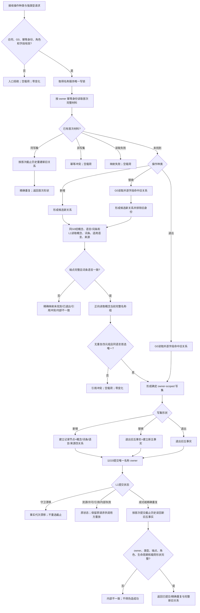

# DATA-L2 写入概念名称关系函数流程图

日期：2026-08-17

版本：v0.1

身份：`DATA-L2-CONCEPT-NAME-STRUCTURE-SERVICE-CLOSURE`

对应目标函数：`L2概念名称结构服务::执行概念名称关系写入(...)`（私有单函数；新增、替换、退出三个公开入口的共同实现根）

## 不变量

1. 本函数始终只使用名称 owner 写端口；概念、词条、语言和来源只读、不可级联修改。
2. 新增建立五个当前事实；替换同事务退出旧五项并建立新五项；退出只关闭旧五项。
3. 同一概念 / 词条 / 角色 / 语言当前关系唯一；同一概念 / 语言最多一个当前首选名称。
4. 任何非成功都返回空载荷、空变更代次和零权威变化。
5. 反向候选读取不在本写函数中做词性、类型、上下文或首项过滤。
6. 发布未知保留原请求、原 `G0` 和原幂等身份；函数不内部重试、不重选截止。
