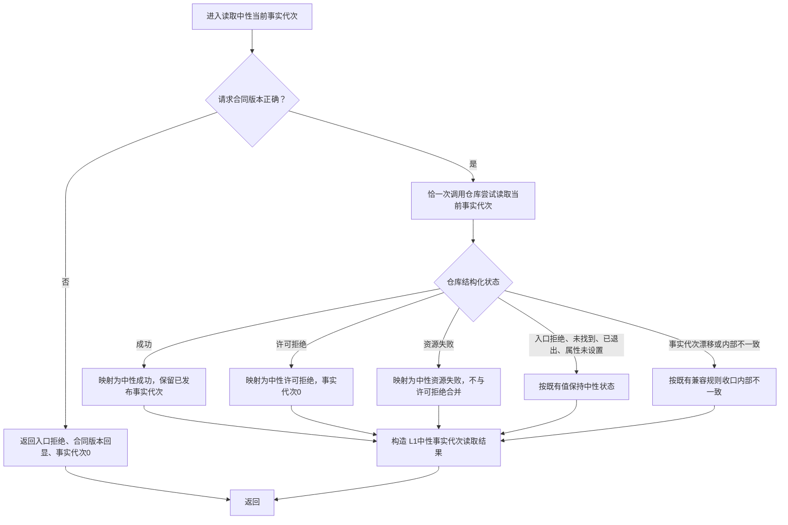

# DATA-L2 L1许可拒绝传播—读取中性当前事实代次函数流程图

日期：2026-08-17

版本：v0.1

身份：`DATA-L2-L1-PERMISSION-REJECTION-PROPAGATION`

函数：`L1中性事实代次读取结果 L1事实基座服务::读取中性当前事实代次(const L1中性事实代次读取请求& 请求) const`

## 不变量

1. 锁竞争发生在取得共享锁之前；许可拒绝只能携带事实代次0。
2. 函数不等待、不重试、不读取 writer 预留代次，不创建无锁代次镜像。
3. 许可拒绝和资源失败不合并；不得把零截止许可拒绝称为事实代次漂移。
4. 本图只表达一个 L1 公开函数。L2 场景 / 存在映射、六入口空载荷和其它直接消费者兼容闭包以同名详细设计为权威。
