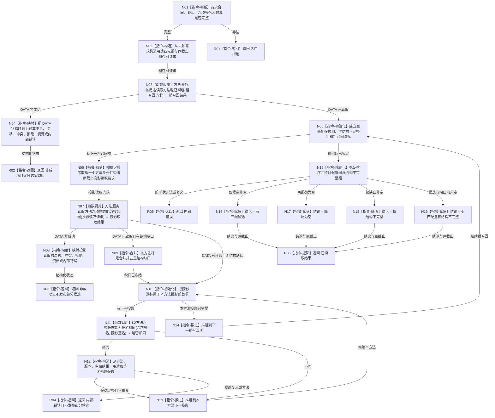

# 形成并匹配方法六项静态能力函数流程图

更新时间：2026-08-22（v0.2）

## 依据

```text
规范/3300_根规范_方法.md v0.6
规范/4240_子规范_语言词条与概念空间纯结构统一合同.md（现行正式版）
规范/4270_子规范_L2方法核心结构与对外接口统一合同_v0.1.md v0.2
规范/5230_子规范_任务筹办与执行边界_20260720.md v0.7
规范/5250_子规范_任务筹办按方法能力查找到就绪因果链_20260720.md v0.4
规范/详细设计/20260821_RUNTIME-GOVERNANCE-METHOD-STATIC-CAPABILITY-ADMISSION_方法六项静态能力投影与候选准入详细设计_v0.1.md（正文 v0.2）
当前代码证据：L2方法结构服务只有旧结果规格召回；没有六项投影或 DATA 外候选准入入口
```

## 身份与边界

本图是目标单函数流程图，只冻结一个待新增根函数。它描述六项静态候选准入，不描述当前就绪复判、方法选择、任务路径、实例方法或真实执行。

六项中的目标对象类型固定为已由 DATA-L2 方法结构写前互证的存在根 `L2概念身份`；结果类型固定为已互证的目标状态合同或动态根概念闭合联合。根函数只比较完整强类型值，不直接读取概念或状态服务，也不从名称、目标值或稳定编码推导类型。

## 函数合同

```text
根函数：方法静态能力候选准入提供者::读取匹配候选
归属模块 / 文件 / 层级：
  海中鱼巣.领域.内部治理.服务.方法静态能力候选准入
  海中鱼巣/领域/内部治理/服务.方法静态能力候选准入.ixx
  DATA 外内部治理业务提供者
现有或待新增：待新增
完整签名：
  方法静态能力准入结果 读取匹配候选(
      const 方法静态能力准入请求& 请求) const noexcept;
参数：
  请求 / const 引用 / 只读借用 / 调用期有效；
  必须包含合同版本、结构请求头、读取类别、共同截止、规范化六项签名和两个非零预算
返回结果：
  方法静态能力准入结果；
  成功读取时携带结论、原共同截止、匹配候选和结构不完整项；
  非成功时只携带结构化状态
被调函数流程图：无；两个 DATA-L2 公开读取函数由本设计冻结，内部实现另由代码知识维护
```

## 流程图



## 节点合同

| 节点 | 类型 | 参数 / 输入绑定 | 结果 / 输出绑定 | 事实读写 | 后继条件 | 验证 |
| --- | --- | --- | --- | --- | --- | --- |
| N01 | 指令-判断 | `请求` | 完整 / 非法 | 零写 | 完整进入 N02；非法进入 R01 | 零版本、零截止、乱序组和零预算均拒绝 |
| N02 | 指令-构造 | `请求.需求`、读取类别、截止、预算 | `粗召回请求` | 零写 | 进入 N03 | 只复制四元组和原截止 |
| N03 | 函数调用 | `粗召回请求 -> 请求` | `粗召回结果` | 只读 DATA-L2 | 成功进入 N05；非成功进入 N04 | 不读取名称或标签 |
| N04 | 指令-映射 | `粗召回结果.结果头.状态` | 业务非成功状态 | 零写 | 进入 R02 | 预算不足不得映射为空候选 |
| N05 | 指令-初始化/循环 | 粗召回稳定组 | 两个结果组、游标 | 零写 | 有项 N06；穷尽 N15 | 空粗召回合法 |
| N06 | 指令-构造 | 当前粗召回项、原读取类别与截止 | 投影读取请求 | 零写 | 进入 N07 | 不升级截止 |
| N07 | 函数调用 | 投影读取请求 | 投影与结构缺口 | 只读 DATA-L2 | 成功 N09/N10；非成功 N08 | 每个方法同一截止 |
| N08 | 指令-映射 | DATA 状态 | 业务非成功状态 | 零写 | 进入 R03 | 不发布已经累积的部分候选 |
| N09 | 指令-合并 | 当前方法结构缺口 | 方法级稳定缺口组 | 零写 | 进入 N10 | 语义相同缺口稳定去重 |
| N10 | 指令-循环 | 当前方法投影组 | 投影游标 | 零写 | 有投影 N11；穷尽 N14 | 零投影与缺口分账 |
| N11 | 函数调用 | 需求签名、投影签名 | 是否逐字段相同 | 零写 | 相同 N12；不同 N13 | 空组无通配语义 |
| N12 | 指令-构造 | 方法、版本、主轴结果、用途、签名 | 候选 | 零写 | 完整 N13；复义 R04 | 候选稳定键完整 |
| N13 | 指令-推进 | 当前投影游标 | 下一投影 | 零写 | 回 N10 | 每份投影只比较一次 |
| N14 | 指令-推进 | 当前粗召回游标 | 下一方法 | 零写 | 回 N05 | 每个方法只读一次投影组 |
| N15 | 指令-规范化 | 两个结果组 | 四种合法组形状或错误 | 零写 | N16—N19 / R05 | 稳定排序、无复义 |
| N16—N19 | 指令-赋值 | 组形状 | 精确结论 | 零写 | R06 | 结论与组形状一一对应 |
| R01—R05 | 指令-返回 | 结构化错误状态 | 非成功结果 | 零写 | 返回调用方 | 零共同截止、零部分结果 |
| R06 | 指令-返回 | 原截止、结论、两个稳定组、扫描数 | 已读取结果 | 零写 | 返回调用方 | `成功()` 必须成立 |

## 关键边界

```text
DATA-L2 只保存、读取并形成值式结构投影，不判断候选资格。
目标对象类型不建立方法专属身份；结果类型联合分支不同即不相等。
本函数只执行六项静态精确匹配，不执行当前就绪复判。
结构不完整粗召回项不能被吞并为“无方法”。
预算不足或任一中途错误不返回部分候选。
旧共同截止不得升级。
全链零任务、需求、路径、实例、学习需求和能力缺口事实写入。
```
