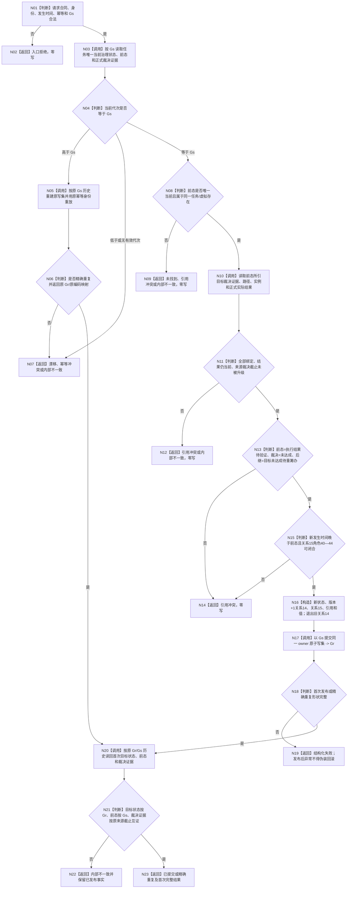

# 提交目标未达成待重筹办迁移函数流程图

更新时间：2026-08-21

## 函数合同

```text
根函数：L2任务结构服务::提交目标未达成待重筹办迁移
输入：任务、任务虚拟存在、前一治理状态、正式目标裁决证据、发生时间、幂等身份和写前代次 Gs
输出：目标状态、前驱状态、原目标裁决证据和写入返回代次 Gr
边界：只作 DATA-L2 结构迁移；不重算目标、不执行路径验证、不启动筹办
```

## 流程图



## 关键机械约束

1. 裁决证据的来源共同截止早于迁移写前代次时保持原值，禁止自动升级。
2. 关系 15 的角色 42 指向方法节点，与角色 41 可以同目标；动作入口通过正式结果与路径材料互证。
3. 精确重复返回首次目标状态，即使它后来已经成为历史；不得把“首次结果”误称为当前状态。
4. 首次发布后读回不一致属于内部不一致，不得声称零写或回滚。
5. 本函数不调用自我线程、路径验证、任务筹办或需求结算。
