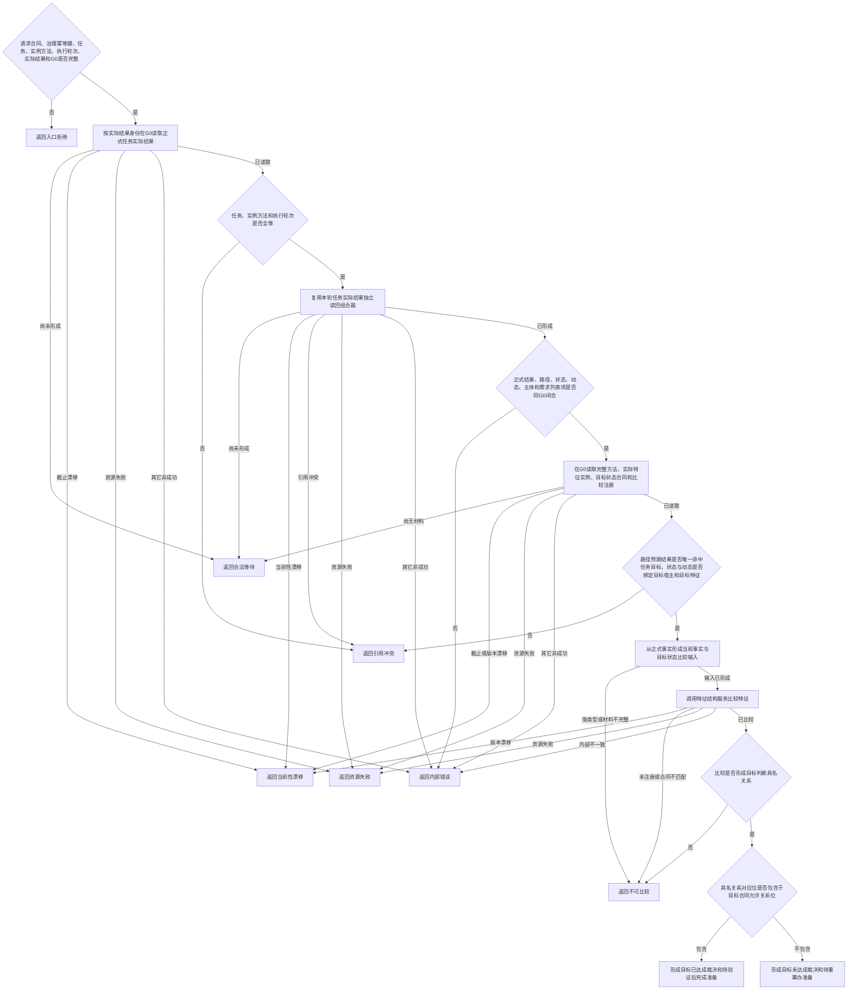

# 裁决任务目标达成函数流程图 v0.1

日期：2026-08-21

计划身份：`RUNTIME-GOVERNANCE-TASK-RESULT-COMPLETION-ADJUDICATION`

根函数：`运行期只读查询组合器::裁决任务目标达成`

## 边界

- 该函数只读并形成值式裁决，不写任务、需求或任何 DATA 事实。
- 目标已达成只形成“待验证后完成”，不能替代验证通过或任务完成。
- 目标未达成只形成“待重筹办”准备，不能直接把任务记为失败。
- 旧 G0 不得自动升级；不可比较、漂移或材料不足不得伪装成未达成。
