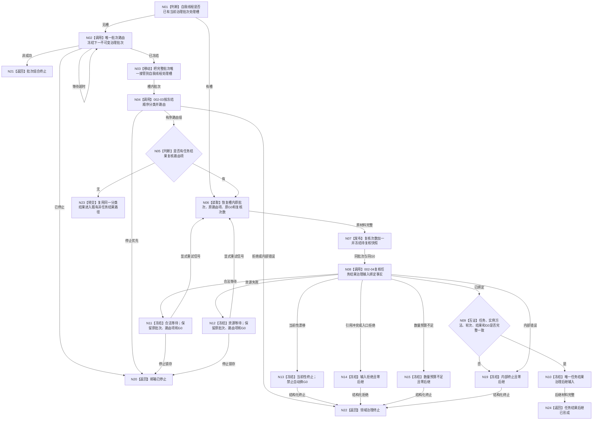

# 自我线程消费任务结果治理输入函数流程图 v0.1

日期：2026-08-21

计划身份：`RUNTIME-GOVERNANCE-TASK-RESULT-PRODUCTION-CONSUMPTION`

根函数：`自我线程::运行治理循环()`中的任务结果生产消费切片。

## 边界

- 重试只回到 N06，不得回到邮箱冻结或 002-03 分类。
- N10 形成的后继输入不是 002-05 请求；本叶不调用任何任务完成、需求满足、结算或学习入口。
- 日志只用于人读进度，完成判断必须读取结构化处理槽快照并逐字段互证。
