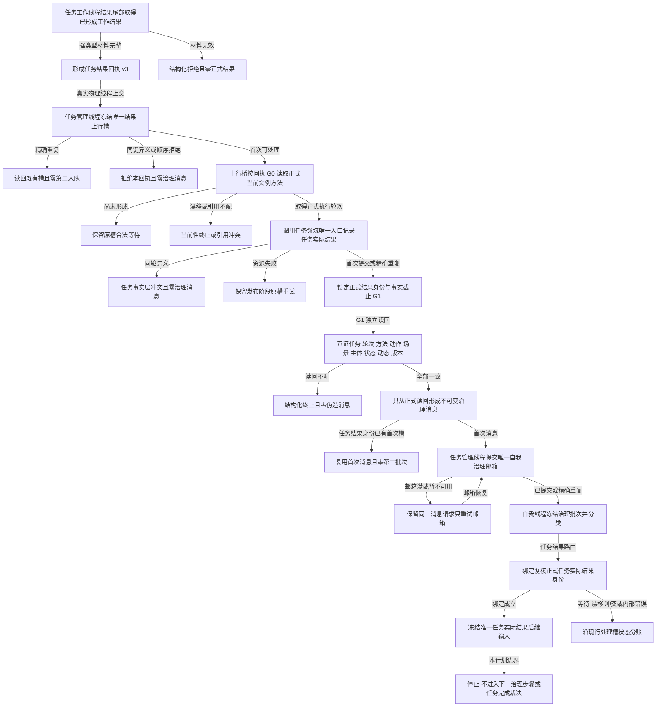

# 任务结果上行生产接线业务流程图 v0.1

日期：2026-08-21

计划身份：`RUNTIME-GOVERNANCE-TASK-RESULT-UPSTREAM-PRODUCER-WIRING`

## 机器边界

- 来源任务序号只参与回执和治理消息顺序，不参与正式执行轮次。
- 正式执行轮次只来自回执 G0 下的当前实例方法。
- 正式结果发布成功后，任何重试都不得再次调用任务结果发布入口。
- 邮箱重试必须保持结果身份、G1、治理消息编号、幂等键、载荷和摘要全等。
- 正常停止先排空工作线程结果，再排空任务管理上行，最后才允许停止自我线程。
- 本图不包含任务执行方法逻辑、任务完成、需求满足、结算、学习、下一治理步骤或跨进程恢复。
