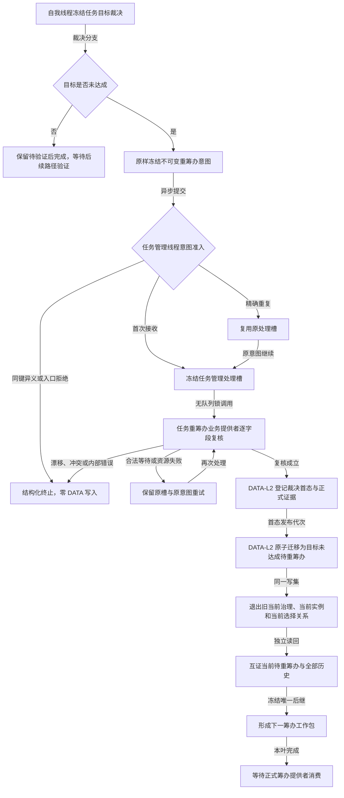

# 任务目标未达成重筹办生产触发业务流程图

版本：v0.1
日期：20260821

```mermaid
flowchart TD
    A["自我线程冻结任务目标裁决"] -->|裁决分支| B{"目标是否未达成"}
    B -->|否| C["保留待验证后完成，等待后续路径验证"]
    B -->|是| D["原样冻结不可变重筹办意图"]
    D -->|异步提交| E{"任务管理线程意图准入"}
    E -->|精确重复| F["复用原处理槽"]
    E -->|同键异义或入口拒绝| G["结构化终止，零 DATA 写入"]
    E -->|首次接收| H["冻结任务管理处理槽"]
    F -->|原意图继续| H
    H -->|无队列锁调用| I["任务重筹办业务提供者逐字段复核"]
    I -->|合法等待或资源失败| J["保留原槽与原意图重试"]
    J -->|再次处理| I
    I -->|漂移、冲突或内部错误| G
    I -->|复核成立| K["DATA-L2 登记裁决首态与正式证据"]
    K -->|首态发布代次| L["DATA-L2 原子迁移为目标未达成待重筹办"]
    L -->|同一写集| M["退出旧当前治理、当前实例和当前选择关系"]
    M -->|独立读回| N["互证当前待重筹办与全部历史"]
    N -->|冻结唯一后继| O["形成下一筹办工作包"]
    O -->|本叶完成| P["等待正式筹办提供者消费"]
```

边界：流程只形成待重筹办结构和下一筹办工作包；不形成新路径、新实例、任务完成、需求满足、结算、价值或学习事实。
