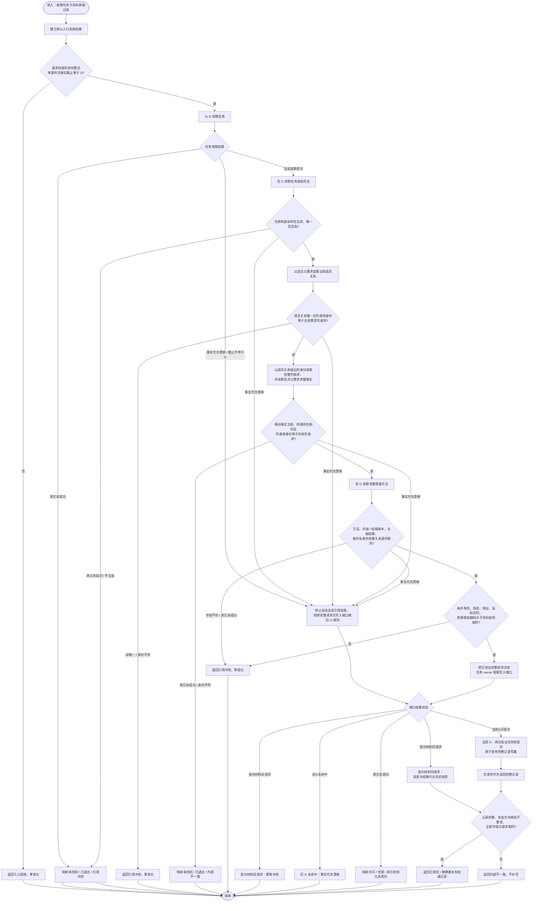

# `新增任务子目标承接记录`函数流程图 v0.1

更新时间：2026-08-22

## 1. 依据与身份

```text
规范/0050_项目通用机器逻辑与禁止性规则总纲_20260721.md
规范/3100_根规范_需求.md
规范/3200_根规范_任务.md
规范/5210_子规范_任务状态特征集合与阶段关联_20260720.md
规范/5220_子规范_子任务完成触发父任务重筹办_20260720.md
规范/详细设计/20260822_DATA-L2-TASK-SUBGOAL-ACCEPTANCE-WAITING-RECORD_任务子目标承接等待记录详细设计_v0.1.md
当前代码 main@6322a884a88000fce36f49dea2df0eef1682b5dd
```

本图是待新增函数`L2任务子目标承接记录结构服务::新增任务子目标承接记录`的单函数施工图。它只建立任务 owner 下的强类型记录，不建立需求，不判断独立子目标准入，不选择父需求，不直接唤醒来源任务。

## 2. 函数合同

```cpp
L2任务子目标承接记录写入结果 新增任务子目标承接记录(
    L2新增任务子目标承接记录请求 请求) noexcept;
```

归属：

```text
module 海中鱼巣.领域.服务.L2任务子目标承接记录结构
海中鱼巣/领域/服务.L2任务子目标承接记录结构.ixx
```

输入完整绑定任务、任务虚拟存在、筹办轮次、显式父需求、采用方法 / 版本 / 主轴 / 条件、子目标、来源截止 G 和幂等身份。成功只形成状态为`待绑定子需求`的记录。

## 3. Mermaid 流程图



## 4. 节点施工映射

| 节点 | 责任与不可变条件 |
| --- | --- |
| N02 | 合同版本、全部强身份、轮次、角色、来源稳定编码、G 和幂等身份必须有效；坏形状不读取服务 |
| N04—N06 | 首个任务读取一旦报告旧 G，必须进入首次写入材料探测；禁止把该漂移直接返回并截断可收敛重复 |
| N07—N08 | `任务.任务虚拟存在 == 请求.任务虚拟存在`，虚拟存在反向任务也必须一致 |
| N10—N14 | `读取需求成员列表`只消费成员关系与列表项身份；完整列表项和完整父需求必须另读并互证所属存在，解决旧审查 DRIFT-1 |
| N16—N19 | 方法、版本、主轴、条件和条件结果关系均来自同一 G 的完整普通方法投影；DATA 不判断独立子目标准入 |
| N20 | 外层服务不取得 L1 raw 端口；只有任务 owner 受限端口可写 |
| N22—N24 | 同完整请求精确重复、异请求冲突、未提交旧 G 漂移三分支唯一 |
| N25 | 节点、关系、属性和建立幂等身份在一个 owner-aware 写集发布；不得事后补关系 |
| N26—N29 | 发布后只读回，不做补偿写或伪回滚 |

## 5. 状态和载荷映射

| 情况 | `L2结构状态` | 记录载荷 |
| --- | --- | --- |
| 首次成功 | `已提交` | 必有，状态`待绑定子需求` |
| 同键同完整请求 | `精确重复` | 必有，为首次结果代次历史投影 |
| 同键异请求 | `幂等冲突` | 空 |
| 旧 G 且首次材料未命中 | `事实代次漂移` | 空 |
| 请求形状非法 | `入口拒绝` | 空 |
| 合法身份不存在 / 已退出 | `未找到` / `已退出` | 空 |
| 跨任务、跨列表、方法字段或目标引用不符 | `引用冲突` | 空 |
| 许可或预算不足 | `许可拒绝` / `数量预算不足` | 空 |
| 资源异常 | `资源失败` | 空 |
| 复义、半结构、读回矛盾、未知状态 | `内部不一致` | 空 |

## 6. 并发、幂等与停止边界

- 所有跨服务读取使用请求 G；任一其它写入使 G 漂移，首次未提交请求零变化。
- 已发布请求即使记录随后绑定、回流或退出，重复建立仍返回首次结果代次的历史投影，不用当前状态冒充首次结果。
- 受限写入端口在任务 owner 互斥边界内再次核对 G 和任务前驱，避免外层验证与提交之间的竞态。
- 本函数不形成子需求身份，不写需求 owner，不创建 BIZ 私有幂等账。
- 本函数返回后，调用方只能进入需求侧后继或结构化失败收口；不得把记录建立成功当成需求已经成立。

## 7. 图外同叶函数

同一代码叶还实现：

```text
绑定任务子目标承接记录子需求
登记任务子目标承接记录回流
退出任务子目标承接记录
读取任务子目标承接记录
按任务轮次读取子目标承接记录组
```

它们的精确状态前驱、请求 / 结果和旧 G 规则以配套详细设计第 6—10 节为唯一施工合同。本图不把五个函数拼成第二个根函数，也不暗示需求入树、父需求重判或重筹办已经实现。
