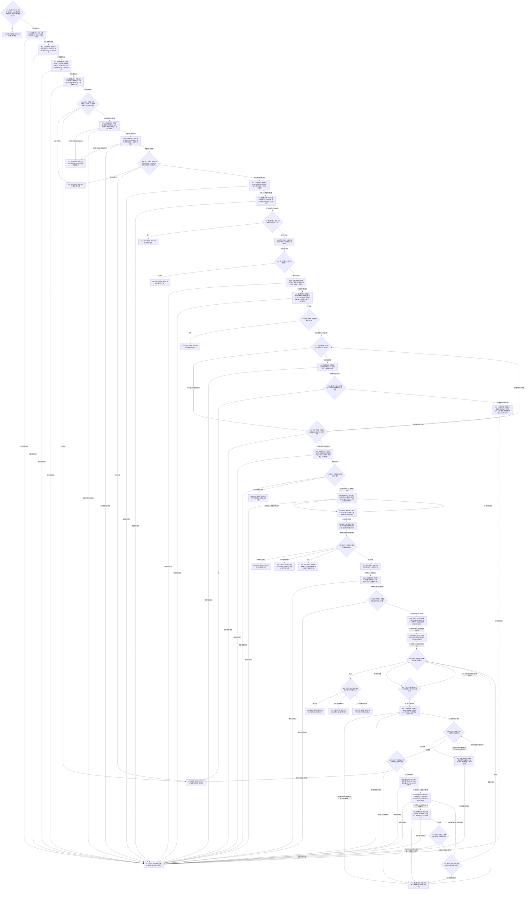

# 评估下一筹办方法候选并形成条件提议函数流程图 v0.1

更新时间：2026-08-22

## 依据

```text
3100 v0.7、3200 v0.7、3300 v0.7、4270 v0.3、5090 v0.3、5230 v0.8、5250 v0.6、5330 v0.4
规范/详细设计/20260822_RUNTIME-GOVERNANCE-TASK-FEATURE-METHOD-LOOKUP-CONDITION-PROPOSAL_任务特征方法查找与条件提议详细设计_v0.1.md
计划/20260822_RUNTIME-GOVERNANCE-TASK-FEATURE-METHOD-LOOKUP-CONDITION-PROPOSAL_任务特征方法查找与条件提议代码实施切片_v0.1.md
当前代码基线 main@9d5672bcbcc990b1958034ac042d6791cdd93f29
```

## 身份与边界

本图是计划设计包中的目标单函数流程图，只冻结待新增根函数；不表示代码已经实现。函数只读并形成值式评估结果，不写需求树，不接任务线程，不形成当前就绪、路径、实例或执行冻结。

## 函数合同

```text
根函数：任务特征方法查找与条件提议提供者::评估下一筹办方法候选并形成条件提议
归属模块：海中鱼巣.领域.内部治理.服务.任务特征方法查找与条件提议
物理文件：海中鱼巣/领域/内部治理/服务.任务特征方法查找与条件提议.ixx
层级：BIZ-L3 内部治理只读提供者；调用 DATA-L2 公开服务
现有或待新增：待新增
完整签名：任务特征方法查找结果 评估下一筹办方法候选并形成条件提议(const 任务特征方法查找请求& 请求) const noexcept
参数：请求；const 引用输入；调用方拥有；函数期内只读；合同版本、工作包、期望截止或预算非法时入口拒绝
返回结果：任务特征方法查找结果；值式返回；非已评估状态零业务载荷；`成功()`只校验结果内在守恒，provider 另保证已评估结果的工作包等于请求工作包且共同截止等于请求期望代次 / 工作包迁移后代次
被调函数流程图：无；被调 DATA-L2 公开函数按各自现行合同执行，不在本图展开
```

## 流程图



## 节点合同

| 节点组 | 类型 | 输入绑定 | 输出 | 事实读写 | 验证 |
| --- | --- | --- | --- | --- | --- |
| N01 / R01 | 判断 / 返回 | 请求、工作包、G、全部预算 | 入口拒绝或继续 | 零读写 | 非法合同、零预算、错代次 |
| N02—N11 | 函数调用 / 判断 / 构造 | 工作包、`任务.需求列表项`、旧结果、完整实际状态 / 特征实例、治理状态、目标合同 | 当前事实待形成、已完成或唯一所需方向 | 只读任务、需求、状态、特征 | 状态身份不得当值；三态、允许位、漂移、互证冲突 |
| N11A—N16 | 函数调用 / 判断 | 存在根、目标宿主、概念支持扫描 / 数量预算与祖先剩余数量预算 | 根直达或普通概念的存在根闭包 | 只读概念 | 支持概念就是根、零/单/多普通概念、错根、退出、环、预算 |
| N17—N22 | 函数调用 / 筛选 / 排序 / 判断 | 目标特征、方向、对象闭包、目标合同 | 适用候选与结构缺口 | 只读方法 | 粗召回空、逐项不兼容、结构缺口、多候选 |
| N23—N33 | 赋值 / 函数调用 / 判断 / 构造 | 唯一采用方案、无预算方法 / 场景读回及调用后上限、条件 / 输入 / 限制 | 原样输入规格 / 限制身份与语义、目标宿主绑定或具名未绑定证据、采用结果、草案 | 只读状态、特征、场景、方法 | 角色等于主轴结果角色时唯一绑定目标宿主，否则不猜映射；状态空组 / 零匹配形成未满足草案，多份同特征当前状态冲突；不升级为就绪 |
| R02—R15 | 返回 | 各分支具名材料 | 合同允许的结构化结果 | 零写 | 非成功零载荷；11 种逻辑结果 required / forbidden 载荷守恒；结果内在`成功()`与 provider 请求 / G 后置条件分账 |

## 关键边界

```text
特征粗召回不是适用候选
适用候选或采用方案不是当前就绪
当前就绪不是路径、实例或执行冻结
任务目标来源只取任务.需求列表项，实际状态身份必须再读完整状态
零概念不猜默认，多概念不任选
支持概念就是存在根时直接入闭包，不冒充普通概念读取
多候选无比较证据不按稳定编码选择
任务不预知方法输入条件或限制条件
条件草案只来自实际采用方法并交需求统一入口
输入规格/限制只在作用对象角色等于主轴结果角色时绑定任务目标宿主，否则保持未绑定并留证据
方法能力缺失只提供后继正式学习门禁材料，当前无适用方法不得进入学习
场景成员与方法完整/投影读取无预算 ABI，只做调用后结果上限
本函数全链零机器事实写入
```
