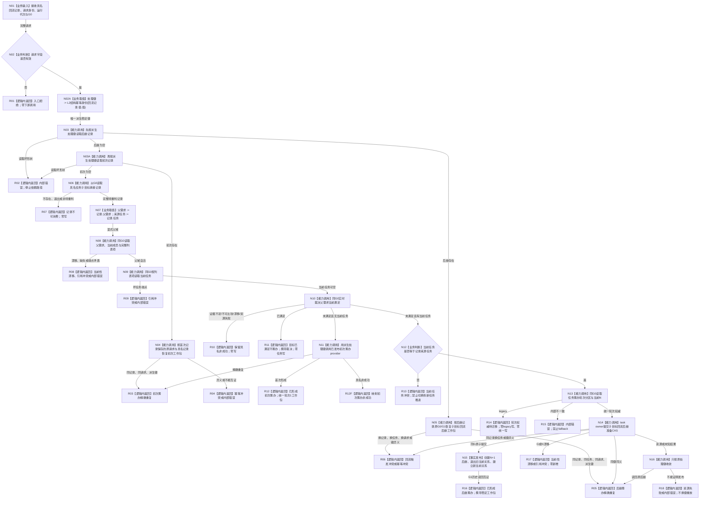

# 任务子目标回流实时重判与筹办准备业务流程图 v0.1

更新时间：2026-08-23

## 依据

```text
规范/0050_项目通用机器逻辑与禁止性规则总纲_20260721.md
规范/3100_根规范_需求.md
规范/3200_根规范_任务.md
规范/5220_子规范_子任务完成触发父任务重筹办_20260720.md
规范/5230_子规范_任务筹办与执行边界_20260720.md
规范/详细设计/20260823_RUNTIME-GOVERNANCE-TASK-SUBGOAL-RETURN-REJUDGMENT_任务子目标回流实时重判与筹办准备详细设计_v0.1.md
计划/20260823_RUNTIME-GOVERNANCE-TASK-SUBGOAL-RETURN-REJUDGMENT_任务子目标回流实时重判与筹办准备代码实施切片_v0.1.md
当前代码基线 fc4afae65d671a8e5470771b8e3638d0b0efb624
```

## 身份与边界

本图是配套详细设计的正式目标业务流程图，对应一个业务闭环：消费一份具名子目标回流记录，实时重判显式父需求，并形成不筹办、初次筹办、统一后继筹办或 legacy 待迁移之一。

本图不证明代码已实现、生产已接线、筹办已执行、父需求已结算或完整业务闭环已验收。流程图只使用 Markdown Mermaid；没有 HTML 配对物。

```text
业务身份：BIZ-TASK-SUBGOAL-RETURN-REJUDGMENT
输入：任务子目标回流重判请求
输出：任务子目标回流重判结果
前置：具名记录身份、请求身份、运行代次和 G0 非零；处理幂等身份只由记录身份派生
完成：形成五类已处理结果之一，或形成具名零变化非成功
```

## 流程图



## 节点合同

| 节点 | 输入绑定 | 输出 | 事实读写 | 当前能力裁决 | 验证 |
| --- | --- | --- | --- | --- | --- |
| N02A | `回流记录.值.值` | 唯一`处理幂等身份` | 零写；不接受调用方键 | 本 provider 内确定性构造 | V01、V06、V07、V11、V12 |
| N03 | 派生`处理幂等身份` | 后继记录 0..1 | 只读 task owner 首次写入材料 / 后继事实 | 直接复用后继按键读取；存在即停止恢复链 | V11、V13、V21 |
| N03A | 派生`处理幂等身份`、后继为空 | 初次记录 0..1 | 只读 task owner 首次写入材料 / 初次事实 | 后继为空后才复用初次按键读取 | V06、V07、V13 |
| N06 | `回流记录`、G0 | 当前记录 | 只读具名记录，不扫描记录组 | 直接复用`读取任务子目标承接记录` | V02、V03 |
| N08 | `记录.父需求`、G0 | 父需求、成员、列表项 | 只读需求 owner 当前投影 | 组合复用三个公开读取 | V03 |
| N09 | `成员.列表项`、G0 | 当前任务 0..1 | 只读 task owner 当前关系 | 直接复用`按需求列表项读取当前任务` | V05、V08、V14、V15 |
| N10 | `记录.父需求`、请求身份、G0 | 已满足 / 未满足裁决 | 只读当前世界与需求事实 | 直接复用`裁决需求当前满足` | V04、V20 |
| N11 | 父需求、派生处理键、请求 / 运行、G0 | 初次工作包 | 可能原子创建任务、首次记录、统一权威和轮次1当前关系 | 直接复用既有初次 provider | V05—V07 |
| N13 | 当前任务、G0 | 统一 / legacy / 内部不一致 | 只读 task owner 权威 / 当前链 | 直接复用强类型分区读取 | V15、V16 |
| N14 | 记录、任务、当前N、派生处理键、G0 | 后继提交结果 | task owner 单事务；请求键必须等于记录值 | 新建子目标回流专用提交函数；复用已发布登记和键 | V08—V13、V17—V21 |
| N15 | 新后继写集 | G1 后继与当前关系 | 新建后继；退出旧当前；建立新当前 | 新建写集 helper；不写旧路径 / 实例 / 结果 / 状态 | V09、V10、V22 |
| N16 | 原处理键 | 已发布后继或未证明 | 只读首次写入和历史后继 | 直接复用按后继准备键读取 | V21 |

## 业务—能力—函数映射

| 业务节点 | 能力合同 | 复用 / 新建 | 目标函数组 |
| --- | --- | --- | --- |
| 具名记录读取 | 指定记录身份在 G0 的当前值式快照 | 复用 | `L2任务子目标承接记录结构服务::读取任务子目标承接记录` |
| 显式父域读取 | 父需求、成员、列表项同 G0 完整互证 | 组合复用 | `读取需求完整`、`读取需求成员列表`、`读取需求列表项完整` |
| 当前任务读取 | 列表项 0..1 当前任务 | 复用 | `L2任务结构服务::按需求列表项读取当前任务` |
| 当前满足实时裁决 | 当前事实与目标合同正式比较 | 复用 | `运行期只读查询组合器::裁决需求当前满足` |
| 无任务初次筹办 | 同列表项唯一任务 + 统一轮次1 | 复用 | `需求初次筹办准备提供者::形成唯一任务与初次筹办工作包` |
| 统一分区读取 | 版本化权威、当前端点和 N | 复用 | `L2任务结构服务::按任务读取筹办轮次分区` |
| 子目标回流后继 CAS | 同记录一次、同任务 N→N+1、历史保留 | 新建 | `L2任务结构服务::提交任务子目标回流后继筹办准备` |
| 完整业务编排 | 按键恢复、父重判和四分支 | 新建 | `任务子目标回流重判提供者::重判父需求并准备筹办` |

## 事务与返回边界

```text
只读预判不是事实发布。
初次分支的事实发布边界沿用既有初次 task-owner 原子事务。
后继分支唯一事实发布边界是 N15 的 task-owner 原子写集。
目标已满足、legacy、当前任务冲突和全部非成功均零任务写。
发布后坏读回不撤销；发布未知只按记录身份派生的稳定键收敛。
初次 / 后继写结果一旦存在，同记录只能恢复原分支；零写结果只绑定本次G0，后续新G允许重新实时裁决且不新增第二决策账。
```

禁止直接宣称：初次筹办或本 provider 已生产接线、legacy 已迁移、筹办已执行、旧路径已复活、父需求已结算、成员结果已分配或完整业务闭环已完成。

## 验证

1. 本文件存在且包含一个 Mermaid fenced block；无新增或同步 HTML。
2. 一图只描述具名子目标回流记录的实时父需求重判与筹办准备闭环。
3. 每个分支都有具名返回；没有“处理”“唤醒”等隐藏机器语义的抽象成功节点。
4. 业务—能力—函数映射明确区分已发布复用能力和待新建函数。
5. 执行前运行`git diff --check -- 流程图/20260823_任务子目标回流实时重判与筹办准备_业务流程图_v0.1.md`。
