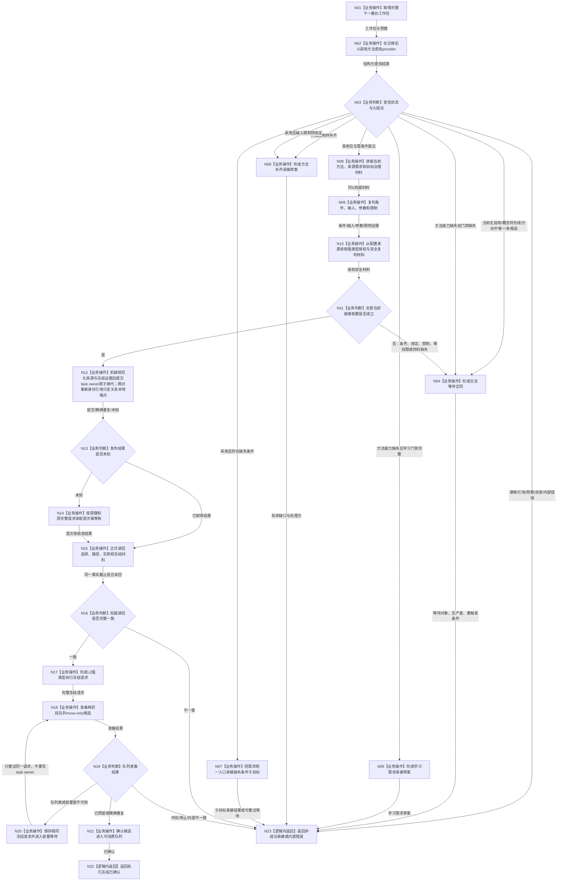

# 任务筹办当前就绪与执行冻结业务流程图 v0.2

更新时间：2026-08-23

## 依据

```text
规范/5230_子规范_任务筹办与执行边界_20260720.md v0.9
规范/5250_子规范_任务筹办按方法能力查找到就绪因果链_20260720.md v0.7
规范/5300_子规范_方法登记选择与执行规则_20260720.md v0.7
规范/详细设计/20260823_RUNTIME-GOVERNANCE-TASK-PLANNING-READY-EXECUTION-FREEZE_任务筹办当前就绪与执行冻结详细设计_v0.2.md
当前代码基线 main@1b15dab9489afd829a24d2f6990c972f4212a22e
```

## 身份与边界

本图是 Stage C 正式目标业务流程图，一图只描述“合法下一筹办工作包收束到非成功承接，或在注入真实强类型授权安全来源后形成执行冻结并确认进入任务管理线程两阶段队列”的闭环。当前普通启动配置为空来源，只能走`N10 -> N11 否 -> N04`形成合法等待；`N12-N22`是具备真实来源时的目标合同路径，不是当前普通启动已可达事实。

输入：完整`下一筹办工作包`及调用预算。

输出：完整非成功承接材料，或已经正式读回且被队列确认的`任务执行冻结请求`。

完成条件不包括方法执行、工作结果、任务完成、结果分配或需求结算。

## 流程图



## 业务—能力—函数映射

| 节点 | 事实读写 | 能力裁决 | 目标函数组 | 事务 / 验证 |
| --- | --- | --- | --- | --- |
| N01 | 只读工作包 | 复用 | `下一筹办工作包完整` | 工作包新轮次、G、运行代次和原键守恒 |
| N02-N03 | 只读任务 / 需求 / 方法 / 状态 / 概念 | 复用 | `评估下一筹办方法候选并形成条件提议` | 九结论载荷守恒、同 G |
| N04-N06 | 形成值式承接材料，不写机器事实 | 新建组合 | `形成任务筹办非成功承接` | 等待对象 / 生产者 / 重触发条件非零且已登记 |
| N07 | 写子目标承接记录与需求统一入口 | 组合复用 | `新增任务子目标承接记录`、`承接任务子目标记录` | 不直写需求树；未知发布保留原请求 |
| N08-N11 | 只读并形成当前就绪证据 | 新建组合 | `复判任务筹办当前就绪` | 方法生命周期、内容、来源成员、条件、输入、限制和安全同 G |
| N12 | BIZ 先逐字段形成纯 DATA-L2 规范化来源与强类型冻结证据，再写 task owner 选择 / 路径 / 实例 / 冻结材料 | 新建 | `发布任务筹办正式选择` | 原工作包十三项机械映射；DATA 零反向依赖 BIZ；原键驱动一次同代原子写；跨对象新身份引用只进入关系端点，不进入原始值材料 |
| N14-N16 | 只读首次账和正式组合事实 | 新建 | `按筹办工作包幂等身份读取正式选择`、`按任务读取当前方法选择` | 返回值不替代权威读回 |
| N17 | 形成值式线程请求 | 新建 | `形成任务执行冻结请求` | v2 L2 强类型协议完整性 |
| N18-N21 | 写线程内存队列状态，不写 task owner | 复用并迁移载荷 | `准备强类型任务执行请求`、`确认强类型任务执行请求`、`撤销强类型任务执行请求` | move-only 候选；容量等待只重试同请求 |
| N22-N23 | 返回结构化终态 | 新建收束 | `任务筹办推进结果::成功` | 成功不等于取出或执行 |

## 关键边界

```text
正式选择记录及其拓扑是唯一选择权威。

兼容路径的条件、输入、参数和归因四项不在同写集内伪造新稳定编码：发布后分别从唯一`选择记录 -> 冻结材料`和`选择记录 -> 路径`拓扑派生。动作入口、预期结果和验证合同继续引用写前已发布身份。禁止新增重复关系或发布后第二次补写路径。
task->path只是同事务派生当前投影，没有独立生产写入口。
DATA-L2 task owner 只接收规范化来源和 L2 强类型冻结 DTO；不得接收工作包或反向依赖内部治理 BIZ。
持久限制解释器保留具名类型，限制当前事实和授权安全来源保留强类型联合分支，不保存裸稳定编码待后解释。
没有限制解释器、没有强类型授权安全证明、权限为零或绑定未闭合，都不能形成执行冻结。
当前普通启动空授权安全来源只能形成合法等待；N12-N22成功分支仅是注入真实强类型来源后的目标合同路径。
发布未知只用原工作包幂等键和原完整请求收敛。
队列容量等待不能再次写task owner事实。
重启不恢复旧运行代次执行权。
本图没有方法执行节点，也没有结果分配或结算节点。
```

## 验证

1. 本文件包含且只包含一个 Stage C 业务闭环 Mermaid 图，不生成 HTML。
2. 每个业务节点在映射表中绑定现有或目标能力和目标函数组。
3. 正常、九结论分流、发布未知、正式读回、容量等待、重启边界均可回指详细设计。
4. 执行冻结已确认只证明队列状态，不升级为方法执行或业务完成；当前普通启动只验证空来源合法等待，成功冻结路径只验证可注入合同和接线。
