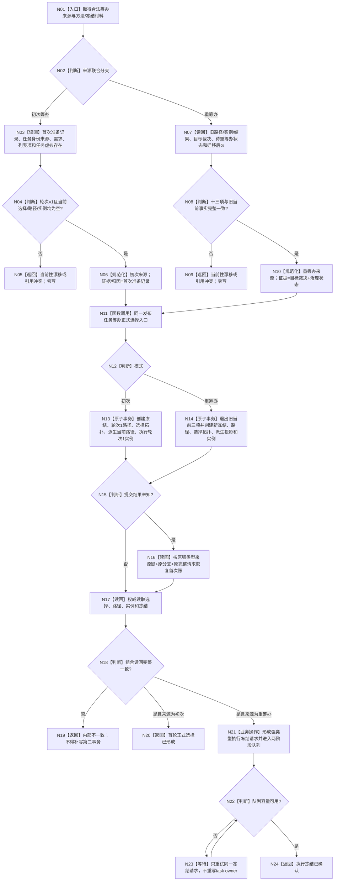

# 任务筹办当前就绪与执行冻结业务流程图 v0.3

更新时间：2026-08-23

依据：5230 v1.0、5250 v0.7、5300 v0.7、`任务筹办当前就绪与执行冻结详细设计 v0.3`

性质：Stage C 目标业务流程图；不是当前代码流程图

## 1. 边界

本图只修订正式选择发布处的来源分流：初次筹办与重筹办进入同一个 task owner 组合发布入口。现有 Stage C BIZ provider 仍从`下一筹办工作包`进入重筹办分支；初次分支当前只由合法消费者和 fresh-DB 专项经公开 owner API 消费，不表示普通初次筹办 BIZ provider 已接线。

结果可共用 / 争用关系发生在任务结果形成、任务完成之后；不进入本图的选择优先级。

## 2. 主流程



## 3. 能力—函数映射

| 节点 | 能力 / 函数 | 事务与验证 |
| --- | --- | --- |
| N03-N06 | `读取首次初次筹办准备记录`、`读取任务`、当前选择 / 路径 / 实例读取 | 首次记录、G0/G1、轮次 1、任务 / 需求 / 列表项当前性；旧当前三项必须为空 |
| N07-N10 | 既有下一筹办工作包互证链 | 旧路径 / 实例 / 结果、目标裁决、治理状态、G 和轮次十三项不放宽 |
| N11-N14 | `发布任务筹办正式选择` | 单一公开入口；来源为 variant；初次不退出旧事实，重筹办原子退出旧当前三项 |
| N16-N18 | `按筹办来源幂等身份读取正式选择`及正式组合读取 | variant 分支属于键；返回值不替代权威读回 |
| N20 | owner 正式结果 | 只证明初次选择合同，不证明普通初次 BIZ provider 已接线 |
| N21-N24 | v0.2 Stage C 线程协议和两阶段队列 | 只对现有重筹办 BIZ 链接线；容量等待不重复发布 |

## 4. 硬边界

```text
一个 task owner 组合发布入口，不建立第二入口。
初次 / 重筹办是强类型互斥来源，不是 nullable 字段拼盘。
初次来源不携带、不伪造旧路径、旧实例、旧结果或待重筹办状态。
重筹办来源仍必须完整互证旧事实。
首次记录与重筹办整数键即使底层值相同，也因联合分支不同而分账。
旧发布当前选中路径入口不恢复。
路径新身份引用继续从选择拓扑发布后派生，不以本地键伪造稳定编码。
结果共用时不排序；结果争用时的成员优先级只属于任务完成后的逐需求分配，不进入本图。
```

## 5. 验证

1. 初次首次 / 精确重复 / 异义 / 已有当前事实 / 成员漂移逐项覆盖；
2. 重筹办 v0.2 全矩阵保持；
3. 五处 fresh-DB bootstrap 只调用正式初次准备和公开 owner 入口；
4. 旧入口、伪旧结果、测试后门、结果分配代码均零新增；
5. 本图只含一个 Mermaid 业务图，不生成 HTML。
