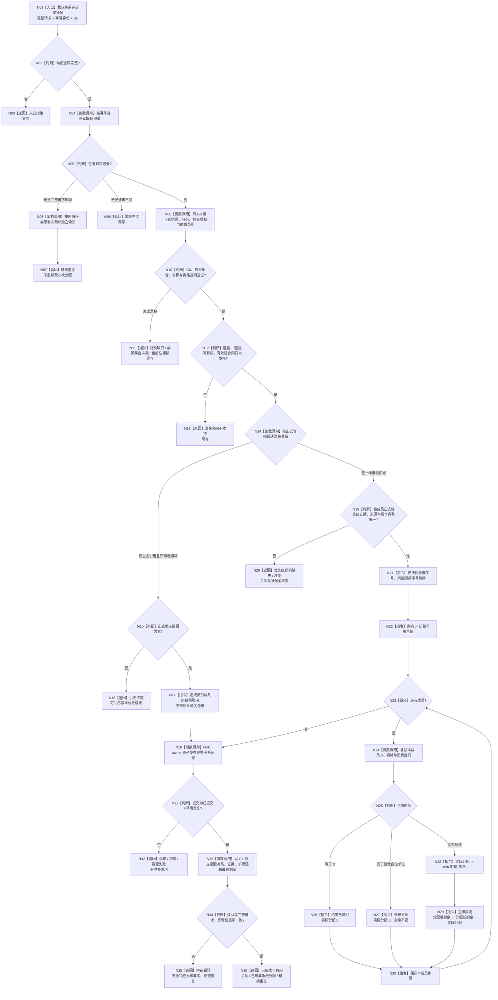

# 任务结果消费关系与争用分配业务流程图 v0.1

日期：2026-08-23
身份：RUNTIME-GOVERNANCE-TASK-RESULT-CONSUMPTION-ALLOCATION
性质：第四层目标业务流程；不是当前代码流程图

配套详细设计：`规范/详细设计/20260823_RUNTIME-GOVERNANCE-TASK-RESULT-CONSUMPTION-ALLOCATION_任务结果消费关系与争用分配详细设计_v0.1.md`

配套代码计划：`计划/20260823_RUNTIME-GOVERNANCE-TASK-RESULT-CONSUMPTION-ALLOCATION_任务结果消费关系与争用分配代码实施切片_v0.1.md`

## 1. 业务边界

输入必须完整绑定正式任务实际结果、G0 冻结成员集合、每成员目标与消费资格、结果容量 / 范围 / 所有权 / 有效性合同及规则版本。输出只可能是一个不可变可共用关系记录或一份包含正式优先级证据、逐项分配和最终剩余的争用记录。

本图不裁决任务完成，不进入逐需求目标满足、5160 正式结算、价值、预算或归因，不激活旧 `BIZ-L2-004-06`，不表示代码已经实现或生产接线。

## 2. 主流程



## 3. 事务不变量

```text
可共用：优先级证据组为空，剩余账为零

争用：
初始剩余 = 容量合同初始可用单位
第 i 项.分配前剩余 = 第 i-1 项.分配后剩余
第 i 项.分配后剩余 = 第 i 项.分配前剩余 - 第 i 项.实际分配
最终剩余 = 最后一项.分配后剩余
```

关系、正式优先级证据、成员结果和最终剩余只能一次原子发布。稳定编码升序只用于成员集合互证和输出规范化，不能进入 N21 的业务排序键。

## 4. 非成功边界

- 关系不可裁决、成员集合冲突、合同不支持、优先级 provider 输入缺失、同级顺序冲突或当前性漂移：关系与分配全零写；
- `未获分配`、`结果已耗尽`是争用记录内的成员分配结果，不是任务失败、需求未满足或结算成功；
- 发布未知只能以原完整请求和原键恢复；
- 可共用成员之间相互独立，某成员的后继非成功不能污染其它成员；
- 本流程结束后仍未执行逐需求目标满足与 5160 正式结算。
