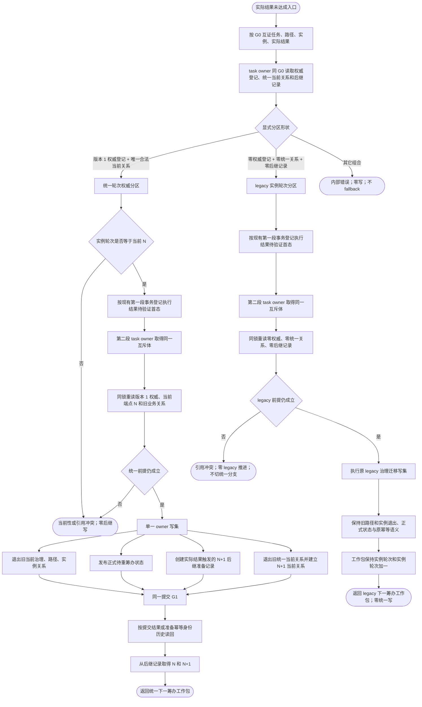
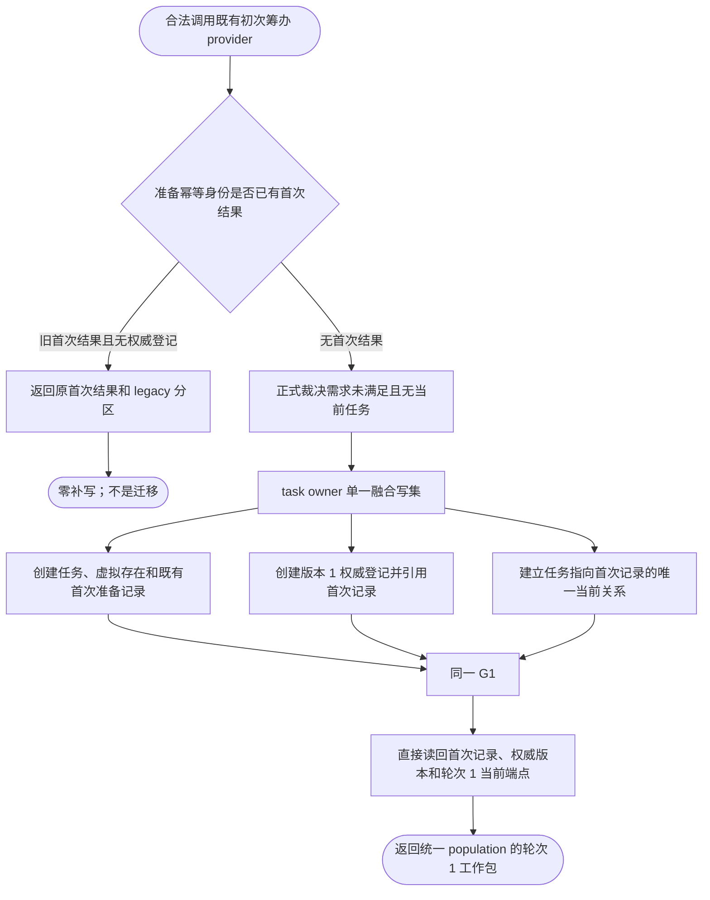
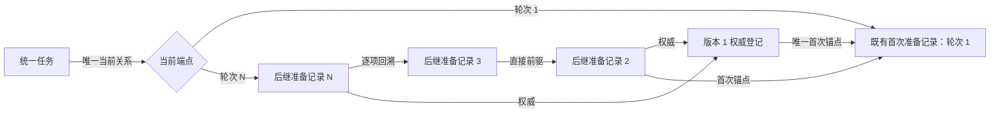

# 任务统一筹办轮次账与当前关系业务流程图 v0.1

日期：2026-08-23
对应详细设计：`规范/详细设计/20260823_RUNTIME-GOVERNANCE-TASK-PLANNING-ROUND-AUTHORITY_任务统一筹办轮次账与当前关系详细设计_v0.1.md`
对应计划：`计划/20260823_RUNTIME-GOVERNANCE-TASK-PLANNING-ROUND-AUTHORITY_任务统一筹办轮次账与当前关系代码实施切片_v0.1.md`

## 1. 图的边界

本图冻结版本化统一轮次权威、legacy 实例轮次兼容分区和既有实际结果未达成入口的双分区事务。它不实现迁移、初次筹办生产接线、任务子目标回流或筹办执行。

依据：

```text
规范/0050_项目通用机器逻辑与禁止性规则总纲_20260721.md
规范/3200_根规范_任务.md
规范/5200_子规范_任务根据需求初始化_20260720.md
规范/5210_子规范_任务状态特征集合与阶段关联_20260720.md
规范/5230_子规范_任务筹办与执行边界_20260720.md
规范/5250_子规范_任务筹办按方法能力查找到就绪因果链_20260720.md
配套详细设计 v0.1
当前 L2任务结构、需求初次筹办准备和任务目标未达成重筹办实现
```

输入、输出和完成条件：

| 项 | 合同 |
| --- | --- |
| 统一初次输入 | 合法未满足需求、无当前任务、完整初次筹办请求、G0 |
| 实际结果输入 | 任务、路径、实例、实际结果、正式目标裁决、请求 / 幂等 / 运行代次、G0 |
| 统一输出 | 版本 1 权威、唯一当前端点、不可变后继记录、由记录形成的工作包 |
| legacy 输出 | 原正式待重筹办状态和原实例轮次工作包；统一写集为零 |
| 非成功 | 入口拒绝、引用冲突、当前性漂移、触发已消费、资源失败、内部错误 |
| 完成 | 同一任务只命中一个显式分区；统一事务原子，legacy 行为回归不变 |

## 2. 分区与实际结果未达成流程



## 3. 新初次筹办建立统一 population



## 4. 唯一统一链与禁止跨区



禁止形状：

```text
统一请求失败 -> fallback legacy
legacy 请求失败 -> 顺手创建权威登记
缺当前关系 -> 猜轮次 1
按创建时间、编码或调用来源 -> 猜 population
统一分支按实例轮次 + 1 -> 产生轮次权威
迁移与 legacy 推进 -> 同任务并发双写
```

## 5. 业务—能力—函数映射

| 图中节点 | 业务能力 | 当前能力裁决 | 目标函数 / 物理位置 | 事实读写与验证 |
| --- | --- | --- | --- | --- |
| B—D | 按任务读取显式 population | 新建组合读取；复用 task owner 一致当前投影 | `L2任务结构服务::按任务读取筹办轮次分区`，`L2任务结构.数据.h`、`服务.L2任务结构.ixx` | 只读任务、权威登记、统一当前关系和后继历史；V05、V06、V26 |
| E—U | 统一实际结果 N → N+1 | 适配既有第二段原子事务，不新建第二 provider | `L2任务结构服务::提交目标未达成待重筹办迁移`；`任务目标未达成重筹办触发提供者::形成待重筹办与下一筹办工作包` | 写正式状态、后继记录和当前换代；V07—V10、V15—V22 |
| F—AE | legacy 实际结果兼容 | 保留现有 provider 和写集；只加显式分区守卫 | 同上两个现有函数 | 原治理 / 路径 / 实例迁移；统一事实零写；V11—V14、V23 |
| A—L（初次图） | 新任务原子进入统一 population | 扩展既有首次融合事务；不改 BIZ 接线 | `L2任务结构服务::新增任务与首次初次筹办准备记录` | 同 G1 写任务、首次、权威、当前关系；V01—V04 |
| 唯一链图 | 当前和历史轮次读回 | 新建权威 / 后继读回；复用首次历史读回 | `按任务读取筹办轮次分区`及按权威 / 后继身份读取入口 | 只读并逐项回溯；V04、V08、V09、V22 |
| 禁止形状 | 分区互斥与并发收口 | 扩展请求联合、同锁复核和 G CAS | `L2提交目标未达成待重筹办迁移请求`完整性及 DATA 实现 | 跨区零写、无异常 fallback；V13、V14、V18、V19、V26 |

没有未裁决业务节点。迁移、生产接线和 legacy 退役已明确排除，不是本图中的待实现节点。

## 6. 节点与事务合同

| 节点组 | 输入绑定 | 输出绑定 | 事实读写 | 事务 / 后继条件 | 验证 |
| --- | --- | --- | --- | --- | --- |
| B—D | 任务及 G0 | 强类型分区 | 同 G 只读 | 分区形状唯一才继续 | 分区不靠 G / 编码 / 来源猜测 |
| I—L | 统一任务、N、首态 | 第二段统一提交请求 | 首态先写；第二段前重读 | N 和权威仍当前 | 漂移零后继写 |
| M—R | 统一第二段请求 | G1 | 正式状态、N+1、当前换代同写集 | 单一 task-owner 提交 | 三类事实同 G1 |
| V—Z | legacy 任务、首态 | legacy 第二段请求 | 首态先写；第二段前重读零统一事实 | legacy 形状仍成立 | 统一事实零写 |
| AB—AE | legacy 第二段请求 | 原工作包 | 保持原状态 / 路径 / 实例事务 | 不建立权威 | 旧验证全部回归 |
| 初次 F—J | 完整初次请求 | G1 | 任务、首次、权威、当前关系 | 一笔融合写 | 同代、同源、轮次 1 |
| S—U | 提交或幂等读回 | 统一工作包 | 历史只读 | 取本次后继记录，不取最新 | 首次结果稳定 |

## 7. 退役边界

初次筹办生产接线、既有任务具名迁移和 legacy 删除必须由后继独立计划完成。本图只冻结未来迁移必须使用同一 task-owner 锁与 G CAS；它不表示迁移或 legacy 退役已经实现。

## 8. 验证

1. Markdown 必须包含三张可解析 Mermaid 图，不生成、更新或验证 HTML；
2. `git diff --check`通过；
3. 详细设计 V01—V27 与映射表逐项对账；
4. 图中的统一、legacy、内部不一致三种形状与 DTO 联合完全一致；
5. 所有写节点都落在 task owner 事务，返回 / 工作包不冒充机器事实或执行权。
