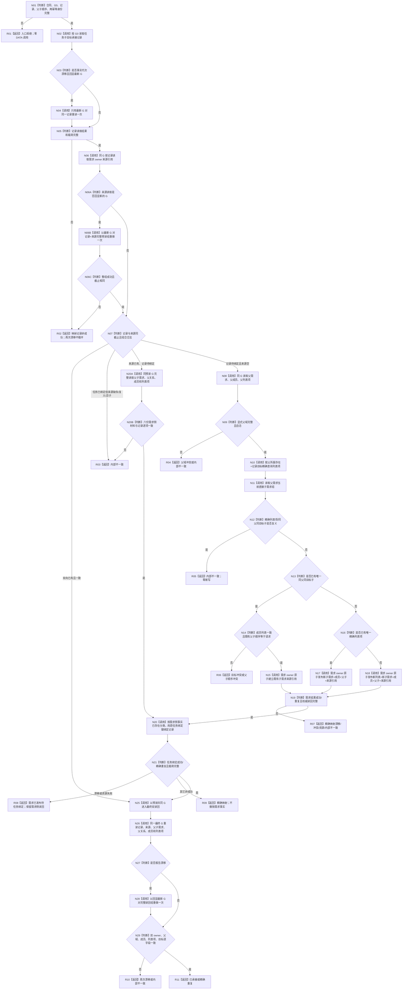

# 承接任务子目标记录形成子需求 函数流程图 v0.1

日期：2026-08-23
状态：施工目标图；不描述当前已实现代码

## 1. 唯一函数身份

```cpp
需求任务子目标承接结果 需求任务子目标承接服务::承接任务子目标记录(
    const 需求任务子目标承接请求& 请求) noexcept;
```

- 目标文件：`海中鱼巣/领域/服务.需求任务子目标承接.ixx`
- 目标模块：`海中鱼巣.领域.服务.需求任务子目标承接`
- 参数：只读值式请求；调用方拥有，两组幂等身份和父子顺序均为显式输入
- 返回：值式结构化结果；只有最终双 owner 同 G 读回一致时成功
- 事实写入：先需求 owner，后任务 owner；本函数不取得 L1、owner、事务或 raw 写端口
- 正式设计：`规范/详细设计/20260823_RUNTIME-DEMAND-TASK-SUBGOAL-RECORD-CONSUMPTION_需求消费任务子目标承接记录详细设计_v0.1.md`

## 2. Mermaid



## 3. 节点合同

| 节点 | 输入 | 调用/动作 | 输出与副作用 |
| --- | --- | --- | --- |
| N01—N05 | 公开请求、记录身份、G0 | 纯值校验；记录最多一次最新 G 重读 | 零写；不无限重试 |
| N06—N07 | 当前记录 | 按记录读取需求 owner 来源关系；来源漂移时最多一次重做完整预读组 | 形成唯一预读共同 G；裁决新承接、需求侧事实已存在、已有双向或内部不一致 |
| N08—N12 | 显式父需求、记录目标 | 读取父域、精确列表项和当前直接子组 | 零写；禁止跨父复用或任选复义项 |
| N13—N18 | 唯一选择结果 | 三个需求 owner 原子入口三选一 | 每次最多一个 owner 写；来源引用与需求结构同代 |
| N19—N21 | 需求读回、任务绑定键 | 新写路径验证含父需求的六份需求结果；恢复路径先完整读回六份需求侧材料；再调用任务记录绑定 | 任务非成功返回需求已发布待任务绑定，不撤销需求 owner 已发布事实 |
| N25—N29 | 最终 G、两个 owner 身份 | 完整双向读回父需求、子需求及两 owner 事实；最多一次整组重读 | 只有父子所属存在等全部一致才返回成功 |

## 4. 禁止边

本函数不得调用或取得：

```text
L1事实基座写入口
L1 owner / 写端口 / 幂等账
任务 owner 私有写端口
需求结构内部 helper
父需求重判
旧任务唤醒或重新筹办
任务创建
需求正式结算
结果共用/争用或优先级分配
```

该图只冻结目标函数。存在本图不证明函数已实现、已编译、已运行或已完成集成验收。
