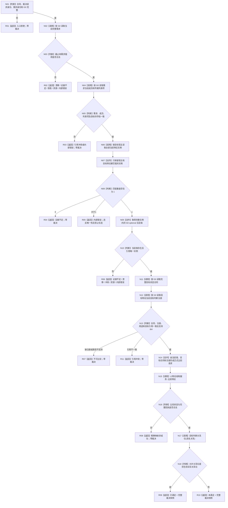

# 裁决需求当前满足 函数流程图 v0.1

日期：2026-08-23
状态：施工目标图；不描述当前已实现代码

## 1. 唯一函数身份

```cpp
需求当前满足裁决结果 运行期只读查询组合器::裁决需求当前满足(
    const 需求当前满足裁决请求& 请求) const noexcept;
```

- 目标文件：`海中鱼巣/领域/组合.运行期只读查询.ixx`
- DTO 文件：`海中鱼巣/领域/运行期只读查询.数据.h`
- 目标模块：`海中鱼巣.领域.组合.运行期只读查询`
- 参数：只读值式请求；调用方提供非零裁决请求身份、需求身份和共同事实截止 G0
- 返回：值式结构化结果；只有`已满足/未满足`携带完整裁决快照
- 事实写入：无
- 正式设计：`规范/详细设计/20260823_RUNTIME-DEMAND-CURRENT-SATISFACTION-ADJUDICATION_需求当前满足实时裁决详细设计_v0.1.md`

## 2. Mermaid



## 3. 节点合同

| 节点 | 输入 | 调用/动作 | 输出与副作用 |
| --- | --- | --- | --- |
| N01—N05 | 请求、需求、成员、列表项 | 入口校验和同 G0 结构互证 | 零写；不从列表项或任务反推需求 |
| N06—N10 | 目标宿主、目标特征 | 读取当前特征实例组，严格执行 0/1/>1，直接取得唯一完整实例内当前值 | 零写；不追加第二次值读取，不按扫描顺序或稳定编码任选 |
| N11—N13 | 目标合同、当前值 | 读取合同和目标判断注册，互证用途、类型和引用 | 证据不足、不可比较和引用冲突分账 |
| N14—N17 | 当前值、目标合同、比较注册 | 构造并执行正式比较，完整核对同 G0 回执 | 禁止组合器比较裸 I64；零事实写入 |
| N18 | 具名关系、允许关系位 | 纯值判断是否满足 | 只返回当前值式裁决，不写永久 bool |

## 4. 禁止边

本函数不得调用或取得：

```text
任务目标达成裁决作为替代入口
任务实际结果、路径、实例或旧筹办冻结
任务子目标承接记录消费
父需求唤醒、新任务、初次筹办或重筹办写入口
需求/任务/结算写入口
L1、owner、raw 端口或内部命名空间
日志、消息或显示输出作为机器事实
结果共用/争用或成员分配优先级
```

该图只冻结目标函数。存在本图不证明函数已实现、已编译、已运行或已完成集成验收。
