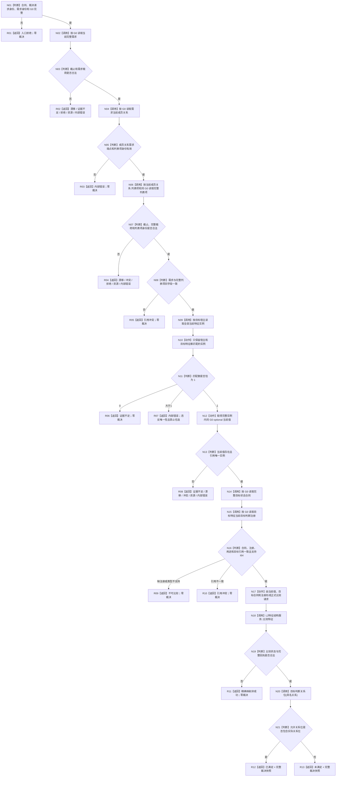

# 裁决需求当前满足 函数流程图 v0.2

日期：2026-08-23
状态：执行期 DRIFT 修订后的施工目标图；不描述当前已实现代码
来源问题：`DRIFT-DEMAND-MEMBER-LIST-ITEM-PROJECTION-INCOMPLETE`

## 1. 唯一函数身份

```cpp
需求当前满足裁决结果 运行期只读查询组合器::裁决需求当前满足(
    const 需求当前满足裁决请求& 请求) const noexcept;
```

- 目标文件：`海中鱼巣/领域/组合.运行期只读查询.ixx`
- DTO 文件：`海中鱼巣/领域/运行期只读查询.数据.h`
- 目标模块：`海中鱼巣.领域.组合.运行期只读查询`
- 正式基础：v0.1 详细设计与函数图
- 本轮修订：成员读取只提供列表项身份；按该身份新增一次同 G0 的`读取需求列表项完整`
- 正式修订：`规范/详细设计/20260823_RUNTIME-DEMAND-CURRENT-SATISFACTION-ADJUDICATION_需求当前满足实时裁决详细设计_v0.2.md`

## 2. Mermaid



## 3. 节点合同

| 节点 | 输入 | 调用/动作 | 输出与副作用 |
| --- | --- | --- | --- |
| N01—N03 | 请求、需求 | 入口校验和同 G0 需求读取 | 零写 |
| N04—N05 | 具名需求 | 读取当前成员关系并校验关系端点 | 不消费成员结果中的简化所属列表项 optional |
| N06—N08 | `当前成员关系.列表项` | 调用`读取需求列表项完整`并用完整事实互证需求四字段 | 六次读取中的第三次；成功快照列表项唯一来源 |
| N09—N13 | 目标宿主、目标特征 | 读取当前特征实例组，严格 0/1/>1，直接取得唯一实例当前值 | 不追加第二次值读取，不任选 |
| N14—N16 | 目标合同、当前值 | 读取合同和注册，互证用途、类型和引用 | 证据不足、不可比较和引用冲突分账 |
| N17—N20 | 当前值、目标合同、比较注册 | 构造并执行正式比较，完整核对同 G0 回执 | 禁止裸 I64 比较；零事实写入 |
| N21 | 具名关系、允许关系位 | 纯值判断是否满足 | 只返回当前值式裁决 |

## 4. 禁止边

本函数不得：

```text
把读取需求成员列表返回的简化所属列表项当作完整列表项
从需求或任务反推/猜测列表项身份
修改 L2需求结构数据头或服务实现
刷新 G0、循环重试或降级读取历史列表项
读取任务实际结果、路径、实例或旧筹办冻结
消费父需求回流、形成新任务/筹办或执行成员结算
处理结果共用/争用或成员分配优先级
```

该图只冻结修订后的目标函数。存在本图不证明函数已修复、编译、运行或完成集成验收。
