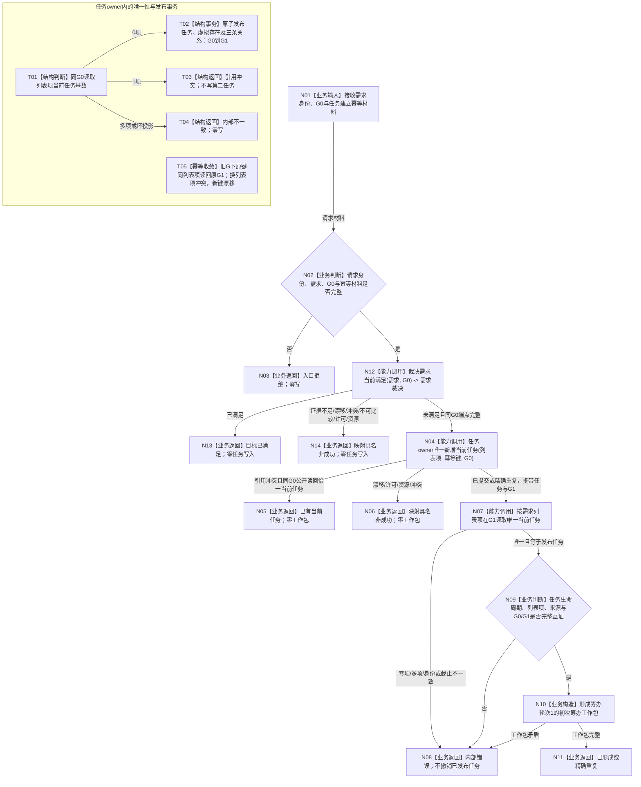

# 需求初次筹办工作包形成业务流程图 v0.1

更新时间：2026-08-23

## 依据

```text
规范/0050_项目通用机器逻辑与禁止性规则总纲_20260721.md
规范/3100_根规范_需求.md
规范/3200_根规范_任务.md
规范/5090_子规范_需求任务方法运行闭环与独立结果回读.md
规范/5200_子规范_任务根据需求初始化_20260720.md
规范/5210_子规范_任务状态特征集合与阶段关联_20260720.md
规范/5220_子规范_子任务完成触发父任务重筹办_20260720.md
规范/5230_子规范_任务筹办与执行边界_20260720.md
规范/5250_子规范_任务筹办按方法能力查找到就绪因果链_20260720.md
规范/详细设计/20260823_RUNTIME-GOVERNANCE-DEMAND-INITIAL-PLANNING-WORK-PACKAGE_需求初次筹办工作包形成详细设计_v0.1.md
当前代码基线 df7ed45cf69ee8a43bf0a14c14df36e3ed9e7408
```

## 身份与边界

本图是新计划的正式目标业务流程图，不是当前代码现状图。它冻结一个业务闭环：同 G0 已裁决未满足的需求在没有当前任务时，由任务 owner 唯一建立当前任务并形成初次筹办工作包。

本图不消费子需求回流记录，不处理已有任务的新重筹办，不调用旧结果重筹办 provider，不进入方法查找、成员结算或结果共用 / 争用。

## 业务输入与输出

```text
输入：需求初次筹办准备请求
  - 非零请求身份、运行代次、需求身份、任务建立幂等身份
  - 同 G0 的 L2 请求头

成功输出：任务初次筹办工作包
  - 唯一当前任务及身份来源
  - 来源需求、当前成员关系、完整列表项
  - 筹办轮次 1、G0、任务建立代次 G1、运行代次

逻辑内输出：目标已满足 / 已有当前任务 / 证据不足 / 当前性漂移 / 引用冲突 / 不可比较 / 入口拒绝 / 许可拒绝 / 资源失败
内部错误：唯一性破坏、发布后读回不一致或工作包内部矛盾
```

## 流程图



## 业务—能力—函数映射

| 节点 | 事实读写与事务 | 当前能力裁决 | 目标函数 / DTO | 验证 |
| --- | --- | --- | --- | --- |
| N02 | 只读请求载荷 | 新建纯值守卫 | `需求初次筹办准备请求有效`（新建、模块私有） | V01、V13 |
| N12—N14 | 同 G0 只读需求、成员、列表项、当前特征、合同与比较注册；零写 | 直接复用已发布 provider | `运行期只读查询组合器::裁决需求当前满足` | V02、V07、V08 |
| N04 / T01—T05 | 任务 owner 唯一写；任务、虚拟存在和三关系同代发布 | 扩展现有函数；不新增第二写入口 | `L2任务结构服务::新增任务`、`读回新增任务` | V02—V06、V11 |
| N05 | L2 引用冲突后以返回截止 G0 公开读回；零写 | 复用当前投影与公开读取；不扩展 L2 非成功载荷 | `L2任务结构服务::按需求列表项读取当前任务` | V05、V06 |
| N07 | G1 只读 | 直接复用 | 同上 | V02、V03、V09 |
| N09—N11 | 纯值互证与最小字段构造；零写 | 新建 | `任务初次筹办工作包完整`、`需求初次筹办准备结果::成功` | V02—V04、V10、V13 |
| 整体 | 至多一次任务 owner 原子发布；发布后不撤销 | 新建 DATA 外 provider | `需求初次筹办准备提供者::形成唯一任务与初次筹办工作包` | V01—V13 |

## 事务、失败与生命周期

```text
写前拒绝：零事实写入
G0 -> G1：唯一一次任务 owner 原子发布
G1 后读回失败：内部错误；不得撤销或退出任务
重复：原键同列表项读回原任务；换列表项冲突，不得换键重放
并发：最多一个请求发布；其它请求漂移或读到已有当前任务
旧任务退出或当前任务改变：旧请求不得返回旧工作包，不得复活旧身份
```

## 关键边界

```text
调用方不能传入自造裁决值；provider 必须调用正式需求裁决入口
工作包不是任务已筹办事实
工作包不复制完整未满足裁决或请求身份；裁决只留在本次 provider 结果
运行代次是调用方协调材料，不是 DATA 事实，消费时仍须验证当前性
轮次1不等于已经存在路径、实例或冻结
工作包不得含旧路径、旧实例、旧执行轮次、旧实际结果或待重筹办状态
下游普通筹办入口必须在G1重新裁决目标
当前已有任务只返回分流材料，本图不负责新重筹办
不消费任务子目标承接记录
不执行成员结算、结果共用/争用或成员分配优先级
```

## 验证

本图按配套详细设计 V01—V13 验证。Markdown 必须包含可解析 Mermaid fenced block；不新增或同步 HTML。设计创建侧运行`git diff --check`、严格规范检查和 Mermaid 渲染检查，实施侧再以 Debug / Release 隔离构建与治理专项验证目标代码。
