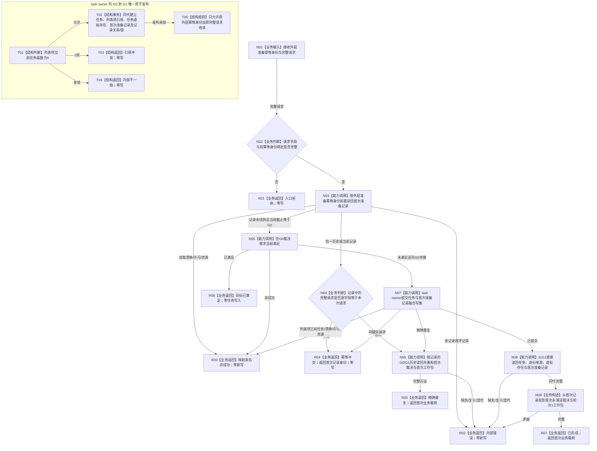

# 需求初次筹办工作包形成业务流程图 v0.2

更新时间：2026-08-23

## 依据

```text
规范/0050_项目通用机器逻辑与禁止性规则总纲_20260721.md
规范/3200_根规范_任务.md 第5.2节、第23节
规范/4260_子规范_L2任务核心方法路径与对外接口统一合同.md
规范/5200_子规范_任务根据需求初始化_20260720.md
规范/5210_子规范_任务状态特征集合与阶段关联_20260720.md
规范/详细设计/20260823_RUNTIME-GOVERNANCE-DEMAND-INITIAL-PLANNING-WORK-PACKAGE_需求初次筹办工作包形成详细设计_v0.2.md
当前正式基线 27b259901d3d69c2492ae200b4cabd96da6f6b42
执行侧安全 WIP：L2 成功谓词、首次写入读回 helper、列表项唯一性守卫和新 DTO 头；本图只读该现场
```

## 身份与边界

本图是计划支撑修订后的正式目标业务流程图，不是当前代码现状图。它只冻结一个闭环：同一份完整初次筹办准备请求首次形成任务、任务虚拟存在、首次准备记录和轮次 1 工作包；之后无论当前事实、任务当前性或任务生命周期如何变化，同一外层准备幂等身份与同一完整请求都先读回并返回该首次结果。

本图排除父回流、已有任务重筹办、方法查找、成员结算、结果共用 / 争用和成员分配优先级。`27b25990`只确认结果共用 / 争用与结算口径，未形成“成员分配优先级”正式 provider；本图不得把需求优先级当作其替代品。

## 业务输入与输出

```text
输入：需求初次筹办准备请求
  - 外层初次筹办准备幂等身份
  - 请求身份、运行代次、L2请求头(G0)、需求身份、任务建立幂等身份

首次成功输出：需求初次筹办准备结果
  - 状态=已形成
  - 首次未满足裁决完整快照
  - 首次任务、任务身份来源、来源成员、完整列表项
  - 首次准备记录身份、任务虚拟存在、筹办轮次1、G0、G1、运行代次

精确重复输出：
  - 状态=精确重复
  - 除状态外，业务载荷与首次成功结果逐字段相同
```

## 流程图



## 业务—能力—函数映射

| 节点 | 事实读写与事务 | 能力裁决 | 目标函数 / DTO | 验证 |
| --- | --- | --- | --- | --- |
| N02 | 纯值 | 扩展 v0.1 DTO，新增外层强类型幂等身份并冻结完整请求相等 | `需求初次筹办准备请求有效` | V01、V04 |
| N03—N05 | 读取 task owner 当前与历史记录；零写 | 新建直接读回 ABI；必须先于需求实时裁决 | `L2任务结构服务::按初次筹办准备幂等身份读取首次记录`、`读取首次初次筹办准备记录` | V03、V05、V10 |
| N06 | 同 G0 只读需求事实 | 直接复用；不保存调用方自造裁决 | `运行期只读查询组合器::裁决需求当前满足` | V02、V07 |
| N07 / T01—T05 | task owner 唯一融合写；一笔 G0→G1 | 扩展现有任务 owner；不得拆成任务写与记录写两笔 | `L2任务结构服务::新增任务与首次初次筹办准备记录` | V02、V03、V06、V11 |
| N08—N09 | G1 发布后直接读回；零新增写 | 读回首次写集，不用当前 G2+ 投影改写首次语义 | `读回新增任务与首次初次筹办准备记录`、`任务初次筹办工作包完整` | V02、V09、V10 |
| R04 | 零写 | 同外层键异完整请求必须冲突 | `需求初次筹办准备状态::幂等冲突` | V04 |
| 整体 | 至多一次 task owner 发布 | 修订既有 provider，不建立独立记录 provider | `需求初次筹办准备提供者::形成唯一任务与初次筹办工作包` | V01—V15 |

## 节点合同

| 节点 | 类型 | 输入绑定 | 输出绑定 | 事实读写 | 后继条件 | 验证 |
| --- | --- | --- | --- | --- | --- | --- |
| N03 | 能力调用 | 外层准备幂等身份 | 0/1/复义记录及观察截止 | 只读 task owner 全历史索引 | 记录存在时禁止先重裁决 | V03、V10 |
| N05 | 能力调用 | 首次记录、G0、G1 | 首次裁决、任务、身份来源、工作包 | 具名历史读取 | 全部来源身份、版本和生命周期互证 | V03、V09 |
| N07 | 能力调用 | 完整请求、首次未满足裁决 | L2融合写结果 | 3节点及关系/值同代原子发布 | 列表项基数0且G0当前 | V02、V06、V11 |
| N09 | 业务构造 | 融合读回 | 首次业务载荷 | 纯值 | 工作包轮次=1且G0/G1一致 | V02、V13 |

## 关键边界

```text
记录身份、任务、需求列表项引用和任务虚拟存在同属 task owner；首次准备记录由任务虚拟存在承载。
记录不是第二份当前需求、当前列表项或当前特征权威；它是不可变的首次裁决和首次结果历史材料。
同外层准备键 + 同完整请求：先读记录，返回首次结果；不得用 G2+ 重裁决覆盖。
同外层准备键 + 异完整请求：幂等冲突；合同版本、请求身份、运行代次、G0、需求、任务建立键任一不同均属异义。
发布未知：只能原键原请求收敛，不得换键或刷新G。
首次任务后来退出、列表项出现新当前任务、需求或成员变化：精确重复仍返回首次任务和首次工作包历史，不返回当前替代品。
“首次结果”在本闭环中特指已经发布任务与首次记录的首次成功结果；入口拒绝、目标已满足、证据不足、漂移、许可或资源失败均在任务发布前零写，不消费准备幂等身份。发布是否未知时必须原键原完整请求先查记录，不能据调用方观感断言零写。
父回流、重筹办、方法查找、成员结算、结果共用/争用、成员分配优先级均不在本图。
```

## 验证

本图按配套详细设计 V01—V15 验证。Markdown 必须包含可解析 Mermaid fenced block，不新增或同步 HTML。创建侧运行 Mermaid 实际渲染、`git diff --check`、严格规范检查与 UTF-8 严格解码；实施侧执行隔离 Debug / Release 重建和治理专项矩阵。
