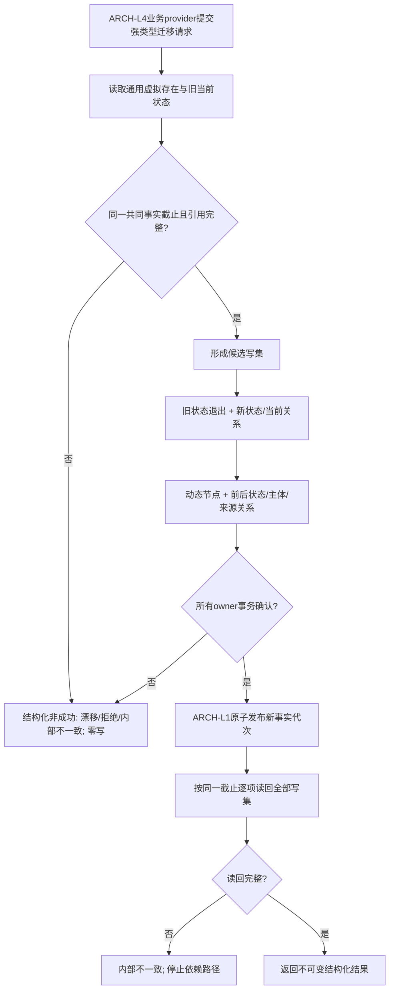

# ARCH-FIVE-LAYER-FOUNDATION 统一虚拟存在、状态、动态原子发布提供者流程图

版本：v0.1
性质：设计合同图，不是当前代码调用图

图中业务 provider 只提交已裁决的结构请求；DATA-L2/ARCH-L2 不解释目标达成、方法成功或任务完成。执行入口、DTO 和跨 owner 事务必须以详细设计和代码计划为准。

## 修订记录

| 日期 | 版本 | 修订内容 |
| --- | --- | --- |
| 20260824 | v0.1 | 建立通用虚拟存在、状态/动态唯一 owner 与同代原子发布的单流程根。 |
