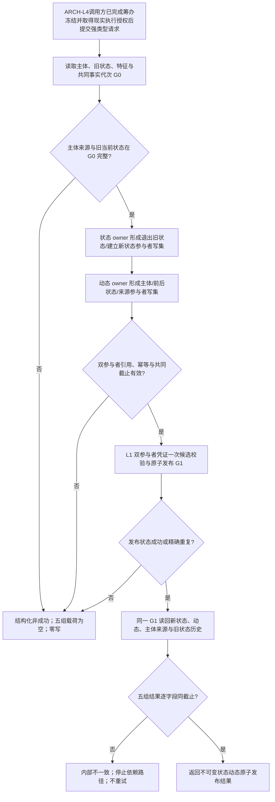

# ARCH-FIVE-LAYER-FOUNDATION 统一虚拟存在、状态、动态原子发布提供者流程图

版本：v0.2
性质：设计合同图，不是当前代码调用图

图中 L1 凭证只绑定状态/动态技术 owner，不接受可写 owner 字段；状态与动态普通 CRUD 不经过该入口。`想`/`看`不调用写入口；安全硬否决、活动资格、调度配额、现实执行授权及轮次后继决议均在调用方/ARCH-L4，不在图内推导。成功、重复、非成功和发布未知的精确字段合同以详细设计 v0.2 为准。

## 修订记录

| 日期 | 版本 | 修订内容 |
| --- | --- | --- |
| 20260824 | v0.2 | 合并为单根图，冻结分离 owner、双参与者一次提交、G0/G1 同截止读回和零载荷失败边界。 |
