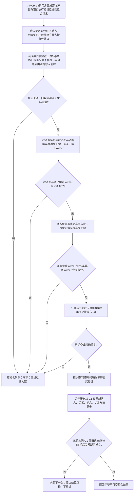

# ARCH-FIVE-LAYER-FOUNDATION 统一虚拟存在、状态、动态原子发布提供者流程图

版本：v0.3
性质：设计合同图，不是当前代码调用图

状态参与者局部键由状态服务声明，动态后状态关系使用带参与者序号的类型化引用；L1 不接受无位置引用列表。节点引用节点只走关系，标量/文本/材料只走属性槽和值；内部/向外/外来由源/目标节点 owner 对观察者推导，不写入关系属性。owner 与代表节点可先后建立且不要求原子，局部键不得冒充 owner。provider 只复用 owner-aware 节点与源/目标关系组读取，不做全 owner 扫描、递归图读取或内外分类。`想`/`看`、安全否决、资格、配额、现实授权和轮次后继均不在 provider 图内推导，日志不参与机器断言。4015 重签发端口属于恢复后继，不是本图的首次运行前置。

## 修订记录

| 日期 | 版本 | 修订内容 |
| --- | --- | --- |
| 20260824 | v0.3 | 将参与者形成、局部键、类型化跨 owner 引用、单 G1 发布和五组 G1 读回落实为单根流程。 |
