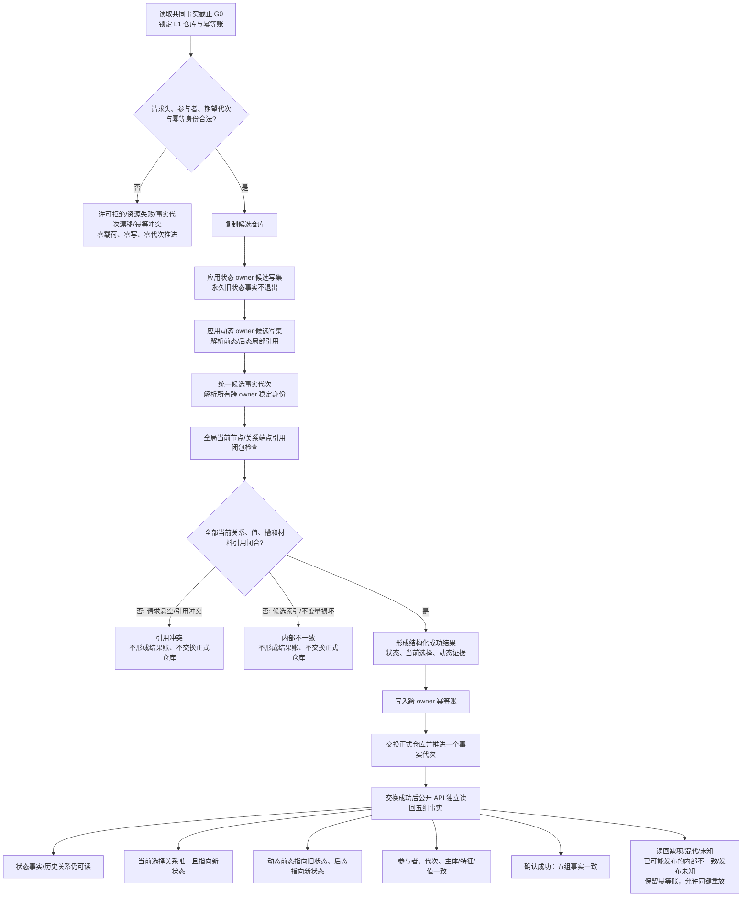
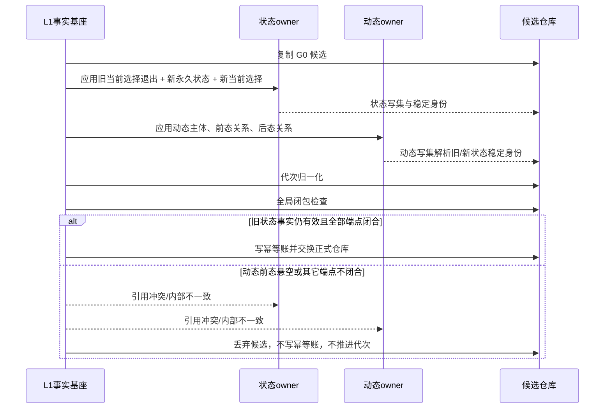
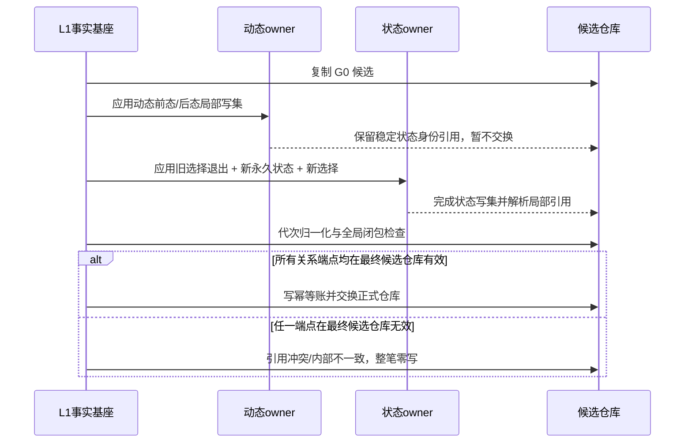
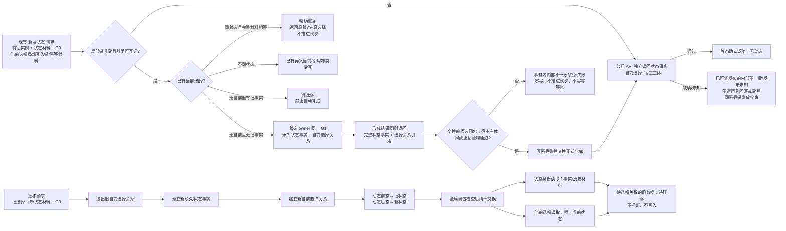

# ARCH-L1-L2-STATE-HISTORY-CURRENT-SELECTION-REFERENCE-CLOSURE

## 状态动态原子发布与当前选择引用闭包流程图 v0.2

> 设计基线：`main@c6e2431e612a13a4e8aa277cd94b31e06a12431c`
> 本图是中性 L1/L2 施工图；不表达任务、方法、需求或结算业务。

### 1. 两参与者原子发布总流程

### 2. 状态 owner 先应用、动态 owner 后应用

### 3. 动态 owner 先应用、状态 owner 后应用

### 4. 首态、迁移与当前/历史读取

图中“失败零写”仅适用于正式仓库交换前的候选闭包/互证失败；交换后独立读回是确认与验收，不得声称回滚或零写。“历史可读”不等于继续当前，当前性只由状态 owner 的选择关系表达。
