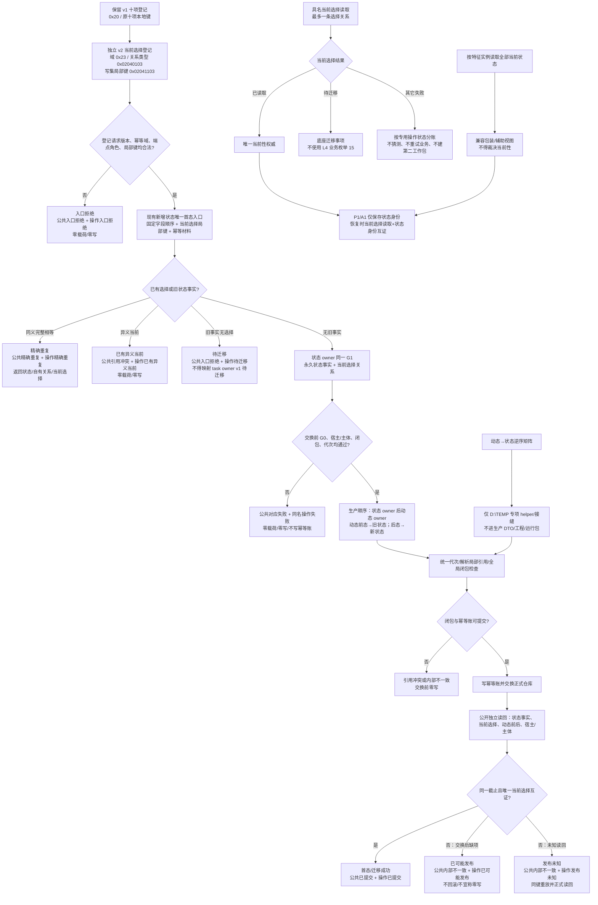

# ARCH-L1-L2-STATE-HISTORY-CURRENT-SELECTION-REFERENCE-CLOSURE

## 状态动态原子发布与当前选择引用闭包流程图 v0.3

> 设计基线：`main@4a05152a01676341e8ff9bb9b706dc8621c1f79e`
> 单一施工流程图；不表达任务、方法、需求或 L4 工作包持久化。

图中只有一个 Mermaid、一个 `flowchart TD`。交换前失败和交换后读回失败严格分账；L4 的 `初次请求版本待迁移=15` 只属于 task owner 历史 v1 八槽请求，不承载本底座当前选择缺失。

`TASK-ROUND-INITIAL-STATE-ARCH-L2-MIGRATION v0.3` 保持待激活；底座发布不会自动解除其 ABI/工作包证据门禁，后续须由 L4 同身份 v0.4 接管。
