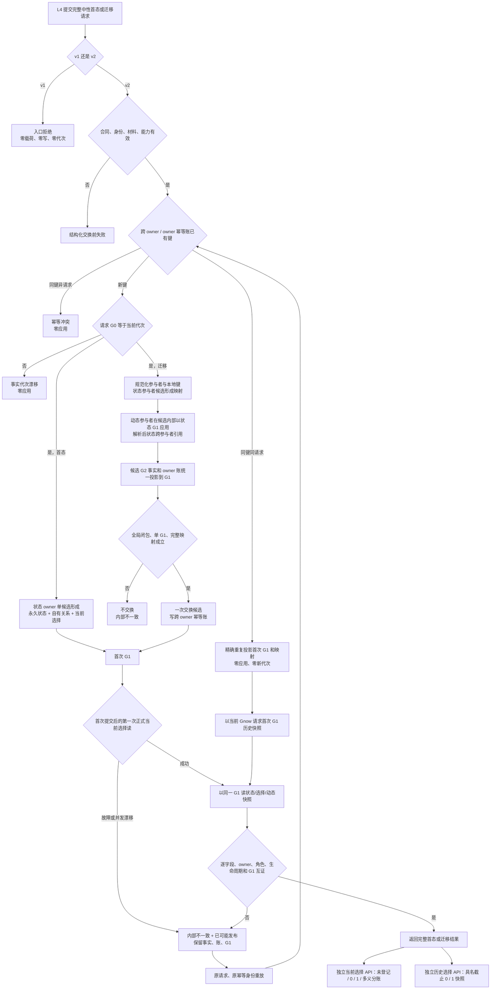

# ARCH-L1-L2 状态历史、当前选择与引用闭包流程图

版本：v0.4
日期：2026-08-25
状态：与基础提供者公开 ABI 同步

## 说明

- 公开请求没有参与者顺序参数；L1 内部唯一规范顺序为状态参与者后动态参与者，并按本地键升序归一。
- 首次提交用正式当前选择读取证明“刚发布即为当前”；精确重复用首次 G1 历史快照恢复原结果，不宣称旧选择此刻仍当前。
- 首态路径不建立动态。迁移只退出旧当前选择，旧状态及其自有关系永久保留。
- 提交后失败不是零写；只有交换前失败承诺零写。
