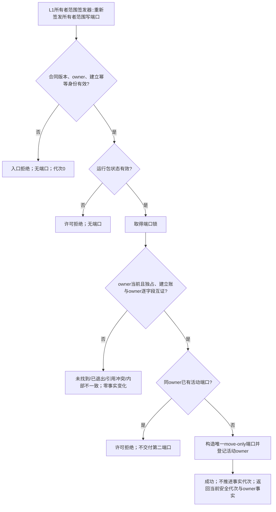

# ARCH-L1-OWNER-PORT-REISSUANCE 所有者范围写端口重签发流程图

版本：v0.1
对应详细设计：`规范/详细设计/20260824_ARCH-L1-OWNER-PORT-REISSUANCE_所有者范围写端口重签发中性恢复提供者详细设计_v0.1.md`
图类型：单一 L1 管理函数；不表示现有代码已实现

重签发不建立 owner、不修改事实、不调用 L2，不包含任务或业务分支。退出与重签发共享“端口锁→仓库管理验证/变更”的顺序。
