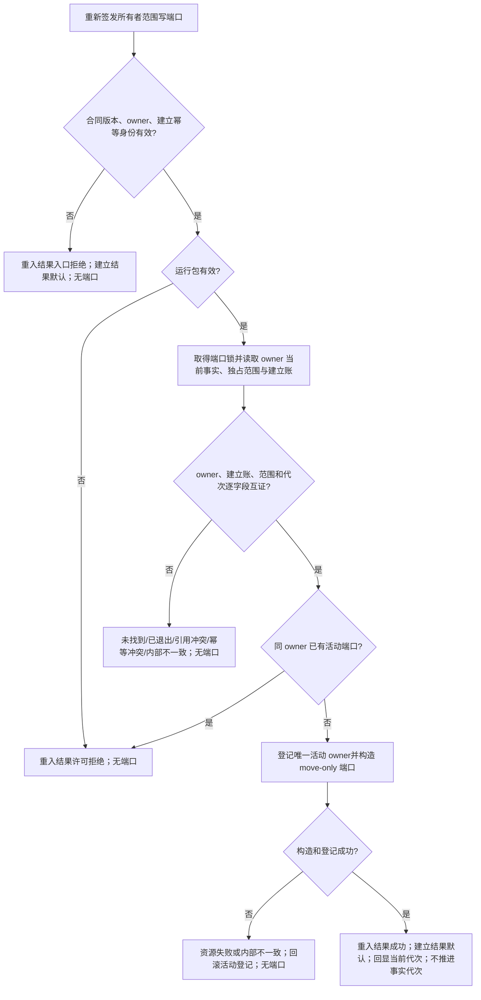

# ARCH-L1-OWNER-PORT-REISSUANCE 所有者范围写端口重签发流程图

版本：v0.2
对应详细设计：`规范/详细设计/20260824_ARCH-L1-OWNER-PORT-REISSUANCE_所有者范围写端口重签发中性恢复提供者详细设计_v0.2.md`
图类型：单一 L1 管理函数；不表示现有代码已实现

同一 `L1所有者范围交付` 追加 `重入结果` 字段但保留既有 `建立结果`/`写入端口`；建立函数只填建立结果，重签发只填重入结果。所有非成功分支端口为空，日志不参与机器断言；不建立 owner、不发布事实、不进入 L2/L4。

## 修订记录

| 日期 | 版本 | 修订 |
| --- | --- | --- |
| 2026-08-24 | v0.2 | 以兼容交付 DTO 冻结重签发结果分账和非成功空端口流程。 |
