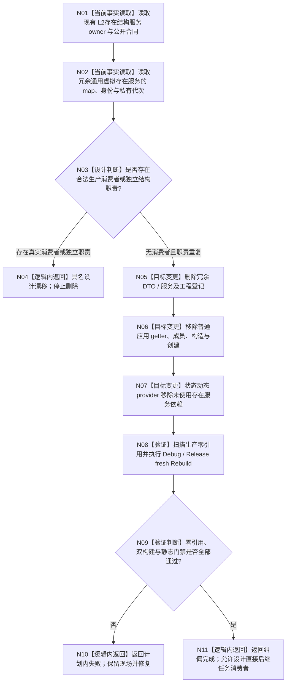

# ARCH-L2-GENERIC-VIRTUAL-EXISTENCE-AUTHORITY-CORRECTION 通用虚拟存在适配与状态动态依赖纠偏流程图

更新时间：2026-08-24

## 依据

```text
规范/0050_项目通用机器逻辑与禁止性规则总纲_20260721.md v1.5
规范/5200_子规范_任务根据需求初始化_20260720.md v0.7
规范/详细设计/20260824_ARCH-L2-GENERIC-VIRTUAL-EXISTENCE-AUTHORITY-CORRECTION_通用虚拟存在唯一权威纠偏详细设计_v0.1.md
当前代码 main@a1c76c515e558a0ae9c0a016847be755afd327c0
```

## 身份与边界

本图是正式目标依赖纠偏图，只表达“移除第二存在权威并保留状态动态正式依赖”这一闭环，不表示当前代码已经完成修改，不授予计划外施工。

输入：当前装配、`L2存在结构服务`、状态 / 动态服务和原子 provider。
输出：唯一存在 owner 保留，冗余服务退出，provider 构造依赖收敛。
完成条件：生产零冗余引用、根工程双配置通过、后继消费者只能使用正式 `L2存在身份`。

## 流程图



## 节点合同

| 节点 | 类型 | 输入 | 输出 | 事实读写 | 后继条件 | 验证 |
| --- | --- | --- | --- | --- | --- | --- |
| N01 | 当前事实读取 | 现有存在服务 / owner | 唯一存在能力证据 | 只读 | 读取完成 | owner、G0/G1、公开入口 |
| N02 | 当前事实读取 | 冗余服务源码 | 重复职责证据 | 只读 | 读取完成 | map、私有身份、私有代次 |
| N03 | 设计判断 | 两组证据和全仓调用扫描 | 删除或漂移裁决 | 不写 | 无消费者才删除 | 生产调用点零命中 |
| N05—N07 | 目标变更 | 已冻结白名单 | 收敛后的生产依赖 | 修改 / 删除代码 | 全部完成后验证 | staged 文件白名单 |
| N08—N09 | 验证 | 候选代码 | 结构化 PASS / FAIL | 只读构建输出 | 全门禁 PASS 才完成 | 零引用、双配置、strict、diff |
| N11 | 逻辑内返回 | 全部验证证据 | 首叶完成结果 | 不写机器事实 | 激活直接后继 | 不夸大为 G1 或治理闭环 |

## 业务—能力—函数映射

| 业务节点 | 当前能力 | 裁决 | 目标函数 / 文件 |
| --- | --- | --- | --- |
| 唯一存在身份与生命周期 | `L2存在结构服务` | 复用 | `领域/服务.L2存在结构.ixx`，本叶不改 |
| 冗余存在候选 | `L2通用虚拟存在结构服务` | 删除 | 两个通用虚拟存在源码 |
| 状态动态主体校验 | 状态 / 动态参与者形成函数 | 复用 | `形成状态原子参与者写集`、`形成动态原子参与者写集` |
| 原子 provider 装配 | 普通应用 + provider 构造 | 简化 | `装配.普通应用.ixx`、`服务.L2状态动态原子发布.ixx` |

## 关键边界

```text
不新增第二存在 owner
不把 ARCHL4 宿主语义下沉到 ARCH-L2
不改变状态动态公开请求 / 结果 DTO
不运行或伪造 G1 消费者矩阵
不修改历史设计和记录
```
