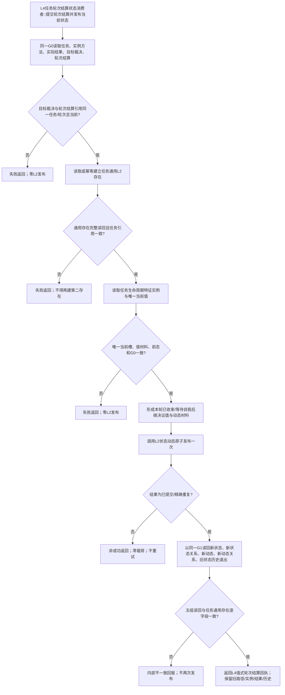

# ARCH-L4-TASK-VIRTUAL-EXISTENCE-LIFECYCLE-FOUNDATION 任务轮次结算到通用状态动态原子发布流程图

版本：v0.1
对应详细设计：`规范/详细设计/20260824_ARCH-L4-TASK-VIRTUAL-EXISTENCE-LIFECYCLE-FOUNDATION_任务通用虚拟存在与生命周期状态基础闭环详细设计_v0.1.md`
图类型：单一业务函数流程图；不表示代码现状，不授予施工许可

图中不含路径验证算法、目标比较、任务完成、重新筹办、需求结算、授权或学习分支；“目标裁决”只作为已形成的上游值式材料读取。任何新增写入口必须先修订详细设计并取得新的计划身份。
