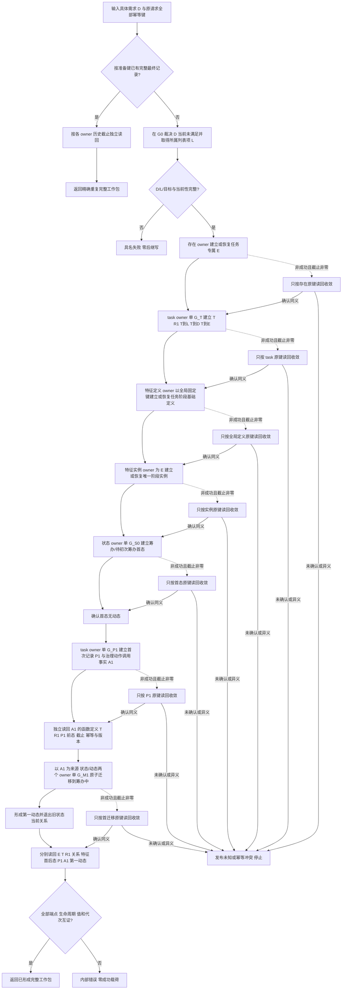

# TASK-ROUND-INITIAL-STATE-ARCH-L2-MIGRATION 任务轮次首态分阶段发布业务流程图

版本：v0.1
日期：2026-08-24
性质：业务流程图；冻结一个“具体需求形成首个任务轮次与筹办中状态”的业务闭环，不表示当前代码已经实现

## 节点合同

| 节点 | 必须成立 | 明确禁止 |
| --- | --- | --- |
| E1 | E 来自唯一 `L2存在结构服务`，每个 T 专属 | task owner 新建私有存在节点 |
| T1 | 同一 task-owner 代次建立 T、R1 与三条业务关系 | 把 G_T 写成 E / 状态 / 动态共同 G1 |
| X1 / X2 | 全局定义一次；每个 E 一个实例 | 每任务重复定义、用字符串或枚举缓存代替特征事实 |
| S0 | `{筹办, 待初次筹办}`，绑定 E 与同一特征实例 | 为首态伪造动态 |
| P1 | 引用既有 R1、E、实例、首态；同次形成 A1 | 在首态前建立 P1；用 P1 / 文本 / 魔数冒充动作调用 |
| M1 | `{待初次筹办}->{筹办中}`，形成第一动态并引用 A1 | 使用空旧态、另一个 E / 实例或坏函数 / 前态 / 版本 |
| U1—U7 | 原键、原请求、公开读回 | 换键、刷新请求、跨越未确认阶段 |

## 完成声明边界

本图只冻结业务四检查点与七个 owner 提交段的关系。它不表示跨 owner 原子创建整份工作包，也不证明普通启动线程、方法筹办、执行、结果、结算或跨进程恢复已完成。
