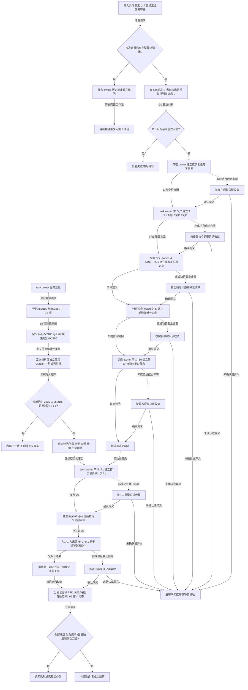

# TASK-ROUND-INITIAL-STATE-ARCH-L2-MIGRATION 任务轮次首态分阶段发布业务流程图

版本：v0.2
日期：2026-08-24
性质：完整替代业务流程图；冻结一个“具体需求形成首个任务轮次与筹办中状态”的业务闭环

## 依据

```text
规范/4260_子规范_L2任务核心方法路径与对外接口统一合同.md v0.8
规范/详细设计/20260824_TASK-ROUND-INITIAL-STATE-ARCH-L2-MIGRATION_任务轮次首态与ARCH-L2迁移详细设计_v0.2.md
计划/20260824_TASK-ROUND-INITIAL-STATE-ARCH-L2-MIGRATION_任务轮次首态与ARCH-L2迁移代码实施切片_v0.2.md
L1 owner 写集节点 / 关系 / 值共用本地键集合的当前结构校验
```

## 身份、输入与完成边界

```text
业务输入：当前具体需求 D、列表查询锚点 L、运行代次、原请求全部阶段幂等身份
前置：D 当前未满足；D/L/目标同截止完整；各 owner 公开服务来自同一普通应用上下文
业务输出：E、T/R1、T→D/T→E、阶段定义 / 实例、首态、P1/A1、后态、第一动态和七段结果头组成的完整工作包
完成：各 owner 独立读回互证全部身份、端点、材料、生命周期、事实截止和幂等来源
非目标：真实启动线程自动调用、后继筹办、执行、现实改变授权、结算、自我后继决议、跨进程恢复
```



## 业务—能力—函数映射与节点合同

| 节点 | 输入绑定 | 结果 / 事实读写 | 事务 / 后继 | 能力裁决 | 目标函数组 | 验证 |
| --- | --- | --- | --- | --- | --- | --- |
| A—C1 | D、准备键、G0 | 只读既有最终记录或 D/L/目标当前事实；失败零写 | 无写事务；完整才到 E1 | 复用需求查询并扩展外层 v2 恢复 | `需求初次筹办准备提供者::形成唯一任务与初次筹办工作包`、运行期需求查询组合器 | 已有最终记录精确重复；D 已满足 / 漂移零写 |
| E1 | 存在建立键、当前截止 | 建立 / 恢复任务专属 E 与身份来源 | 存在 owner 单段 G_E；确认同义到 T1 | 复用 | `L2存在结构服务::新增存在节点`及公开读回 | E 当前、未退出、身份来源完整；task owner 零存在写 |
| T1 | D/L/E、核心键、G_T0 | 建立 T/R1、T→L/T→D/T→E | task owner 单 G_T；确认到 X1 | 扩展 task owner | `L2任务结构服务::新增任务轮次与正式存在引用`及按建立键读取 | 全部同 G_T；E 仅引用；来源顺序 / 轮次序号均为 1 |
| X1 / X2 | `TASKSTAG`、E、实例键 | 建立 / 恢复全局阶段定义和 E 唯一实例 | 特征定义 G_FD、实例 G_FI 分段 | 复用 | `L2特征结构服务::新增统一特征定义`、`新增特征实例`及读回 | 定义全局一次；实例宿主为 E；重复不伪造变更代次 |
| S0 / N0 | E、实例、首态键、运行代次 | 建立 `{1,1}`首态并确认动态为空 | 状态 owner 单 G_S0；确认到 P1 | 复用 | `L2状态结构服务::新增状态`及状态 / 动态读取 | 来源为 R1、阶段序号 1、无动态 |
| D0—D5 | task owner 登记幂等身份 | 登记 15 项；以 2185/2186/218F 形成定义节点、U64 值和槽并独立读回 | task owner 服务登记写集；定义完整才许可 P1/A1 | 扩展 task owner | `L2任务结构服务`登记与治理函数定义读取 | 映射恰三键；材料 `{1,1,1}`；所属 / 类型 / 来源 / 槽 / 生命周期完整 |
| P1 / A2 | T/R1/E/实例/首态、P1 键、定义事实 | 同次建立首次记录、P1、A1；再独立读回 A1/定义 | task owner 单 G_P1；确认到 M1 | 扩展 task owner | `L2任务结构服务::新增首次准备记录与P1`及 A1 / 定义读取 | P1/A1 在首态后；A1 互证函数、T/R1/P1、前态、截止、幂等、版本 |
| M1 / M2 | 旧首态、A1、首迁移键 | 建立 `{1,2}`后态、第一动态并退出旧当前关系 | 状态 / 动态两个 owner 单 G_M1 | 复用现有跨 owner provider | `L2状态动态原子发布服务::发布状态动态原子迁移` | 动态严格连接首 / 后态，来源为 A1，阶段序号 2 |
| R2 / C2 | 七段确认结果 | 各 owner 公开面最终独立读回；互证后输出完整工作包 | 无新写；矛盾返回内部错误 | 扩展外层守卫 | 准备 provider 完整性守卫与各 owner 公开读取 | 全部身份、端点、值、键映射、生命周期和截止一致 |
| U1—U7 | 原键、原请求、具名 owner 截止 | 只读确认首次发布结果 | 确认同义回到下一段；未确认 / 异义停止 | 扩展外层恢复 | 各 owner 按幂等身份 / 历史截止读取 | 禁止换键、刷新请求、越段或跨 owner 回滚 |

## 完成声明边界

本图冻结七个 owner 提交段、治理函数定义三键写集和原键恢复。它不表示跨全部 owner 的单事务，也不证明普通启动线程、后继筹办、执行、授权、结果、结算或跨进程恢复已完成。
