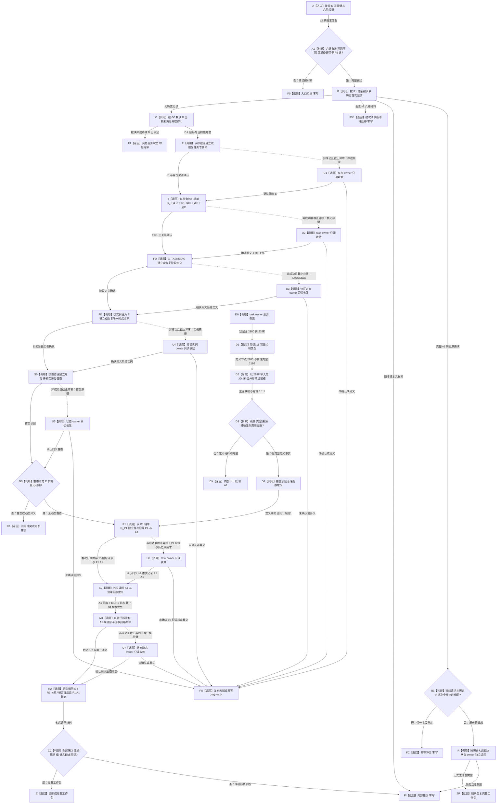

# TASK-ROUND-INITIAL-STATE-ARCH-L2-MIGRATION 任务轮次首态分阶段发布业务流程图

版本：v0.3
日期：2026-08-24
性质：完整替代正式业务流程图；冻结一个“版本化原请求形成首个任务轮次与筹办中状态”的业务闭环

## 依据

```text
规范/4260_子规范_L2任务核心方法路径与对外接口统一合同.md v0.9
规范/5200_子规范_任务根据需求初始化_20260720.md v0.9
规范/详细设计/20260824_TASK-ROUND-INITIAL-STATE-ARCH-L2-MIGRATION_任务轮次首态与ARCH-L2迁移详细设计_v0.3.md
计划/20260824_TASK-ROUND-INITIAL-STATE-ARCH-L2-MIGRATION_任务轮次首态与ARCH-L2迁移代码实施切片_v0.3.md
main@6c7ab8c18f0884af12b6e3acbd127844b5dbf1bf 的生产调用扫描
```

## 身份、输入与完成边界

```text
业务输入：当前具体需求 D、列表查询锚点 L、运行代次、准备键和原请求六阶段幂等身份组
前置：六键非零且两两不同；准备键 == P1 建立键；D 当前未满足；各公开服务来自同一普通应用上下文
业务输出：E、T/R1、T→D/T→E、阶段定义 / 实例、首态、P1/A1、后态、第一动态和七段结果头组成的完整工作包
完成：版本 2 原请求已持久化，各 owner 独立读回互证全部身份、端点、材料、生命周期、事实截止和幂等来源
非目标：真实回流生产上游、真实启动线程、后继筹办、执行、现实执行授权、结算、自我后继决议、跨进程恢复
```

## 流程图



## 业务—能力—函数映射与节点合同

| 节点 | 输入绑定 | 结果 / 事实读写 | 事务 / 后继 | 能力裁决 | 目标函数组 | 验证 |
| --- | --- | --- | --- | --- | --- | --- |
| A—B1 | D、准备键、六键、治理版本 | 校验 v2 信封；只读首次记录版本状态；v1 零写 | 无写；当前 v2 才进入恢复 | 扩展外层 DTO 和 task owner 版本化读回 | `L2任务初次筹办阶段幂等身份组有效`、`按初次筹办准备幂等身份读取首次记录` | 六键零 / 重复；15 槽 v2；8 槽 v1；损坏材料 |
| R / ZR | 历史 v2 原请求、七段截止 | 各 owner 历史读回完整工作包 | 无新写；完整才精确重复 | 扩展恢复守卫 | `需求初次筹办准备提供者::形成唯一任务与初次筹办工作包`及各 owner 读取 | 当前 / 历史六键逐字段相同；异键冲突 |
| C | D、请求头、G0 | 只读 D/L/目标当前事实 | 无写；完整才到 E | 复用 | 运行期需求查询组合器 | 已满足、漂移和证据不足零写 |
| E | 存在键、当前截止 | 建立 / 恢复 E 与身份来源 | 存在 owner 单 G_E | 复用 | `L2存在结构服务::新增存在节点`及读回 | E 当前、未退出；task owner 零存在写 |
| T | D/L/E、任务核心键 | 建立 T/R1、T→L/T→D/T→E | task owner 单 G_T | 扩展 task owner | `新增任务轮次与正式存在引用`及按建立键读取 | 同 G_T；序号均为 1；E 仅引用 |
| FD / FI1 | `TASKSTAG`、E、实例键 | 建立定义和 E 唯一实例 | G_FD / G_FI 分段 | 复用 | 特征定义 / 实例公开建立和读回 | 定义全局一次；实例宿主 E |
| S0 / N0 | E、实例、首态键 | 建立`{1,1}`首态并确认动态空 | 状态 owner 单 G_S0 | 复用 | `L2状态结构服务::新增状态`及状态 / 动态读取 | 来源 R1；阶段序号 1；无动态 |
| D0—D4 | task owner 登记请求 | 15 项登记；2185/2186/218F 定义值和槽 | task owner 登记写集 | 扩展 task owner | `L2任务结构服务`登记与定义读取 | 三键互异；材料`{1,1,1}`；读回完整 |
| P1 / A2 | T/R1/E/实例/首态、P1 键、v2 原请求 | 同次建立首次记录、P1、A1并独立读回 | task owner 单 G_P1 | 扩展 task owner | `新增首次准备记录与P1`及 A1 / 定义读取 | 首次记录 15 槽；准备键等于 P1 键；A1 完整 |
| M1 | 旧首态、A1、首迁移键 | 建立`{1,2}`后态和第一动态 | 状态 / 动态两个 owner 单 G_M1 | 复用 | `发布状态动态原子迁移` | 动态连接首后态；来源 A1 |
| R2 / C2 | 七段确认结果 | 各公开面最终独立读回 | 无新写；矛盾内部错误 | 扩展外层守卫 | 各 owner 读取和工作包完整性守卫 | 身份、端点、值、键、生命周期、截止一致 |
| U1—U7 | 原键、历史 v2 原请求、owner 截止 | 只读确认首次发布结果 | 确认到下一段；未确认停止 | 扩展恢复 | 各 owner 原键读取 | 禁止换键、派生键、越段和跨 owner 回滚 |

## 生产调用者映射

| 当前直接调用点 | v0.3 输入来源 | 非成功 |
| --- | --- | --- |
| `服务.任务子目标回流重判.ixx`历史首次记录分支 | 历史首次记录保存的 15 槽 v2 原请求；当前请求只用于逐字段冲突检查 | v1 返回初次请求版本待迁移；异键返回幂等冲突 |
| `服务.任务子目标回流重判.ixx`无当前任务分支 | 回流请求携带的六键组；P1 键必须等于回流记录编码 | 缺键 / 派生键入口拒绝；不调用初次 provider |

当前`重判父需求并准备筹办`无生产上游；本图不伪造六键分配入口。

## 关键边界

本图只有一个 Mermaid 图，所有边均标注判断条件或传递材料。它冻结七个 owner 提交段、v2 原请求信封、v1 待迁移零写、两个生产调用点和 218F 定义材料值。它不表示跨全部 owner 的单事务，也不证明后继筹办、执行、授权、结果、结算、自我后继决议或完整治理闭环完成。
