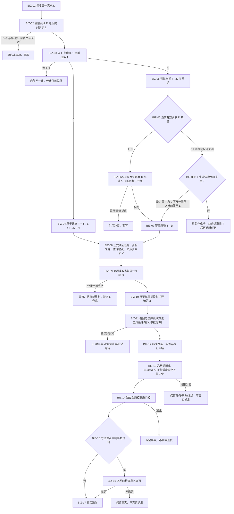
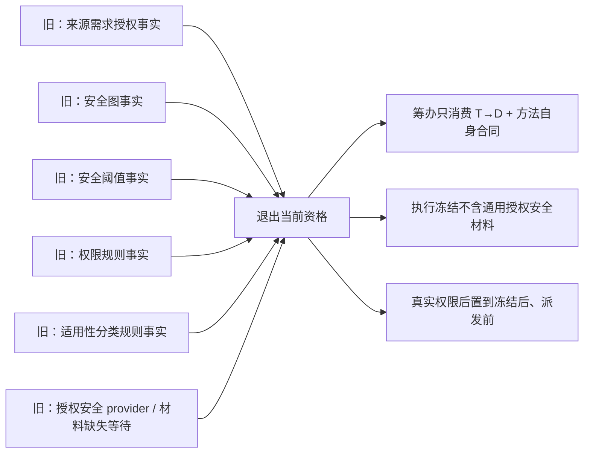

# 任务来源需求承接与授权安全语义解耦业务流程图 v0.1

设计身份：`RUNTIME-GOVERNANCE-TASK-SOURCE-DEMAND-ACCEPTANCE-AUTHORIZATION-DECOUPLING`

日期：20260824

状态：目标业务流程；代码尚未实施

依据：3100 v0.8、3200 v0.8、4250 v0.5、4260 v0.5、5090 v0.5、5200 v0.6、5210 v0.9、5230 v1.1、5250 v0.8、6150 v0.6、6170 v0.2、8200 v0.6、8300 v0.5。

## 1. 业务闭环

## 2. Stage C 删除支线

## 3. 业务节点与能力映射

| 节点 | 所需能力 | 责任边界 |
| --- | --- | --- |
| BIZ-01—02 | 具体需求读取、所属列表成员关系读取 | 需求领域权威；输入必须是 D |
| BIZ-03 | 按同类任务查询锚点读取当前任务 | L 只查询 / 防重；0 / 1 / >1 分账 |
| BIZ-04 | 新任务与首个来源关系原子发布 | task owner 单事务；不得半结构 |
| BIZ-05—07 | 来源关系稳定读取、目标互证、空来源任务生命周期复核、幂等承接 | 0 个当前有效 D 时可先写新 D；L 只证明归类，不提供目标 |
| BIZ-08 | 同截止正式读回 | 任务、身份来源、T→L、T→D、V 完整 |
| BIZ-09—10 | 来源需求当前性和单目标投影 | 至少一项当前 D；D 是目标权威 |
| BIZ-11—12 | 方法召回、方法自身合同、路径 / 实例 / 冻结 | Stage C 五类事实不参与 |
| BIZ-13 | 6150 / 6170 正常调度投影 | 只在冻结后、派发前；零权限不撤销冻结 |
| BIZ-14 | 全局控制态 | 独立门控，不伪装成需求授权 |
| BIZ-15—16 | 具体方法具名许可 | 仅涉及外部主体 / 受保护资源 / 受限能力时 |
| BIZ-17 | 真实派发 | 必须同时满足冻结、权限、控制态和适用许可 |

## 4. 不在本图首叶内

- 任务完成后的结果共用 / 争用与正式分配；
- 自我线程向任务管理发送 D 的生产接线；
- 6150 / 6170 生产权限 provider 的完整实现；
- Release 测试隔离；
- 需求正式结算、价值结算与集成验收。
## ARCH 映射约束（20260824）

本图的任务来源/目标与授权解耦是 `ARCH-L4` 业务流程；图中任务虚拟存在仅表示 ARCH-L2 通用虚拟存在的待迁移引用，不是任务 owner 的第二状态权威。状态、动态和因果必须通过 ARCH-L2 公开服务取得，L3/L5 不在本图内。
