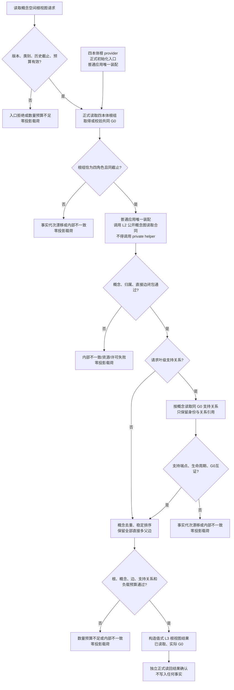

# ARCH-L3-CONCEPT-SPACE-PROJECTION-PRODUCTION-CLOSURE 概念空间根视图读取流程图

版本：v0.1
状态：设计就绪、等待 L4 代码资源释放；只描述未来只读生产入口，不代表当前代码已接线

## 1. 业务 / 结构流程

## 2. 规则注记

- 根组、概念图和支持关系必须来自同一 `G0`；上游截止不一致不允许拼接或自动重试到另一代次。
- L3 只组合公开 L2 结构，不创建概念、不复制世界事实、不解释业务真实性。
- 四本体根初始化中的进程缓存不是根权威；缓存与正式根组读回冲突时返回内部不一致 / 发布未知。
- 四本体根 provider、初始化入口、普通应用装配和工程登记必须以正式根组 / 概念图读回确认成功；“已发布材料”不得成为读入口或第二权威。
- 任一非成功分支都返回空投影；L3 不产生写集、幂等账或持久快照。
