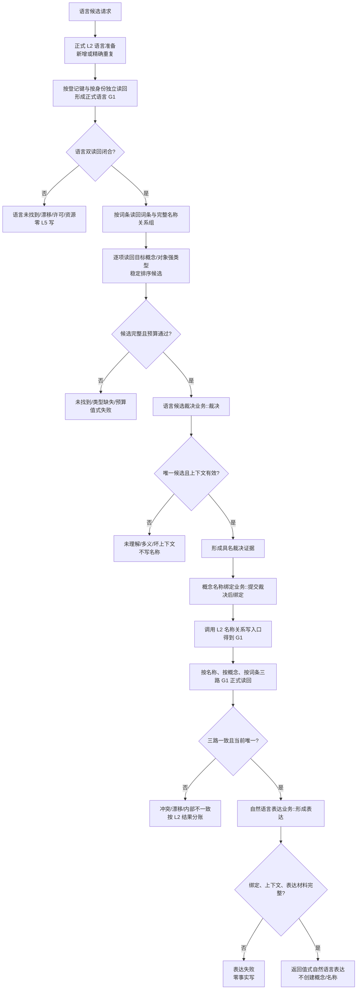

# ARCH-L5-LANGUAGE-CANDIDATE-EXPRESSION-BINDING-PRODUCTION-CLOSURE 语言候选裁决与表达绑定流程图

版本：v0.1
状态：设计就绪、等待 L4 代码资源释放；不代表当前代码已接线

规则：候选和裁决均不写事实；名称关系写入只发生在具名唯一裁决之后；表达阶段永不写事实。任何进程缓存、词索引首项、字符串默认值、旧语素或对应信息都不得绕过正式 L2 读回。
