# SELF-GOVERNANCE-CLOSURE-L4-INTEGRATED 自我内部治理连续实现业务流程图

设计身份：`SELF-GOVERNANCE-CLOSURE-L4-INTEGRATED-IMPLEMENTATION`

版本：v0.1

日期：2026-08-25

状态：连续实施流程候选；未登记、未施工、未验收

直接需求合同：`规范/详细设计/20260825_SELF-GOVERNANCE-CLOSURE_L4消费者需求与提供者验收合同_v0.5.md`

配套详细设计：`规范/详细设计/20260825_SELF-GOVERNANCE-CLOSURE-L4-INTEGRATED_自我内部治理连续实现详细设计_v0.1.md`

## 图示边界

本图只画一个完整业务闭环。`叶1—叶6`是同一连续代码段的内部顺序，不是六份计划或六次验收。中间只做所有权、白名单、目标 ABI 和旧权威回流扫描；真实提供者接入后才统一编译、测试和连续两轮验收。

```mermaid
flowchart TD
    A0["L4需求权威确认目标ABI<br/>并提交交互2"] --> A1["建立同一连续实施计划<br/>目标ABI标记为待实现"]
    A0 --> P0["交互2并行实现ARCH-L1/L2提供者"]
    P0 --> P1{"提供者具名报告目标不可达?"}
    P1 -- "是" --> PX["仅受影响切片DRIFT<br/>禁止降低L4语义"]
    P1 -- "否或尚未返回" --> P2["L4连续设计与实施不等待"]
    A1 --> P2

    P2 --> L1["叶1 重写任务初始化<br/>D/L防重 T/E/R1"]
    L1 --> S0["E首态 {筹办,待初次筹办}<br/>状态owner单G1 无动态"]
    S0 --> S1["独立读回状态与当前选择"]
    S1 --> P1A1["task owner建立P1与A1"]
    P1A1 --> M1["目标ABI发布首迁移<br/>{筹办,筹办中}+第一动态<br/>状态/动态最终单G1"]
    M1 --> R1["状态 当前选择 动态<br/>同截止独立读回"]

    R1 --> L2["叶2 任务管理读取E当前阶段<br/>进入筹办治理"]
    L2 --> PLAN["召回 复核 选择 实例化 冻结<br/>删除Stage C授权安全前置"]
    PLAN --> PC{"筹办闭合结果?"}
    PC -- "等待/子目标/学习/方法补齐" --> PW["保持同一未收束Rn<br/>保存等待与重触发条件"]
    PW --> PR{"实例尚未执行且无正式结果?"}
    PR -- "是" --> NP["建立同一Rn的新Pn<br/>保留旧Pn历史"]
    NP --> PLAN
    PR -- "否" --> SET0["禁止换路<br/>进入结算"]
    PC -- "目标已完成或合法无执行短路" --> SET0
    PC -- "可执行冻结" --> FZ["形成En 冻结和有序动作范围<br/>迁移为可执行已冻结"]

    FZ --> L3["叶3 执行前门控"]
    L3 --> SC{"冻结含现实改变?"}
    SC -- "否:内部治理/纯观察" --> ZA["确认零自我现实执行授权"]
    SC -- "是或混合" --> WA["迁移为待自我现实执行授权<br/>自我owner发布/读回一份授权"]
    WA --> AC{"授权当前且绑定完整?"}
    AC -- "拒绝/等待/失效" --> HOLD["保持筹办冻结后状态<br/>不写任务失败"]
    AC -- "是" --> CTRL
    ZA --> CTRL["读取6170生存控制态"]
    CTRL --> C1{"A大于1?"}
    C1 -- "否" --> NOD["普通任务不派发<br/>任务与冻结保留"]
    C1 -- "是" --> QUOTA["读取安全/服务配额<br/>适用时读取6150倍率"]
    QUOTA --> Q1{"本次调度资格大于0?"}
    Q1 -- "否" --> NOD
    Q1 -- "是" --> TECH{"稳定动作键端口<br/>技术许可当前?"}
    TECH -- "否" --> NOD
    TECH -- "是" --> HARD{"只读安全硬否决命中?"}
    HARD -- "是" --> DENY["阻止动作<br/>授权不得绕过"]
    HARD -- "否" --> RECHECK["真实动作开始前再次复核<br/>状态 冻结 控制态 资格 授权 硬否决"]
    RECHECK --> EXEC["迁移为{执行,执行动作中}<br/>才进入工作队列"]
    EXEC --> WORKER["任务工作线程成为唯一请求消费者<br/>调用冻结的稳定动作键端口"]
    WORKER --> RESULT["动作返回只作待验证材料<br/>实际世界独立回读和归因"]
    RESULT --> FORMAL["发布正式任务实际结果<br/>任务管理独立读回"]
    FORMAL --> SET0["迁移为执行结果待结算<br/>再进入{结算,任务轮次结算中}"]

    SET0 --> L4["叶4 冻结本轮合格T到D成员"]
    L4 --> SHARE{"结果可共用或争用?"}
    SHARE -- "可共用" --> EACH["不建优先级账<br/>逐成员独立核算"]
    SHARE -- "争用" --> ALLOC["读取正式分配优先级<br/>逐项分配并扣减"]
    ALLOC --> EACH
    EACH --> ALL{"每个合格T到D<br/>都有正式核算或具名非成功?"}
    ALL -- "否" --> SWAIT["结算保持未完成<br/>不得迁移为收束"]
    ALL -- "是" --> CLOSEP["互证验证归因 适用价值/学习结果<br/>运行停止 冻结与授权消费收口"]
    CLOSEP --> ROUND["task owner发布任务轮次结算事实"]
    ROUND --> CLOSED["发布轮次收束迁移<br/>{轮次已收束,待自我决议}"]
    CLOSED --> READC["独立读回结算 状态 当前选择 动态<br/>任务停止自行推进"]

    READC --> L5["叶5 自我读取需求当前事实<br/>轮次结算和整体治理事实"]
    L5 --> DEC["自我owner发布唯一后继决议"]
    DEC --> KIND{"继续 / 结束 / 等待 / 取消"}
    KIND -- "等待" --> STAY["零任务写入<br/>保持轮次已收束"]
    KIND -- "结束" --> END["正式结束任务生命周期<br/>不建立新轮次"]
    KIND -- "取消" --> CANCEL["完成取消收口<br/>不建立新轮次"]
    KIND -- "继续" --> NEWROUND["task owner建立R(n+1) 新Pn<br/>继续治理动作和决议引用"]
    NEWROUND --> NEWSTATE["从收束态迁移到{筹办,筹办中}<br/>形成一条新动态"]
    NEWSTATE --> FRESH["重新选择 实例化 冻结<br/>不复用旧路径 结果 授权"]
    FRESH --> PLAN

    READC --> L6["叶6 退役旧任务私有状态<br/>Stage C与自动重筹办链"]
    STAY --> L6
    END --> L6
    CANCEL --> L6
    L6 --> ZDEL["物理整删三旧文件<br/>任务重筹办数据 重筹办触发服务<br/>任务重筹办意图协议"]
    ZDEL --> ZSCAN["零路径/零工程登记/零生产引用<br/>删除端口 槽 自动工作包路由"]

    ZSCAN --> JOIN{"真实提供者已按目标ABI接入?"}
    JOIN -- "尚未接入" --> JWAIT["保留完整L4候选<br/>不声称编译或验收"]
    JOIN -- "已接入" --> ABI["核对公开模块 DTO 结果矩阵<br/>只允许无语义机械适配"]
    ABI --> BUILD["一次性联合编译<br/>Debug/Release隔离Rebuild"]
    BUILD --> TEST["一次性完整流程统一测试<br/>首次 重放 冲突 漂移 许可 资源 故读回"]
    TEST --> TWO["连续两轮生产级端到端验收<br/>R1停驻 自我继续后才有R2"]
    TWO --> OK{"13项最终合同全部有权威证据?"}
    OK -- "否" --> FAIL["整体闭环未完成<br/>按真实缺口纠偏"]
    OK -- "是" --> DONE["L4自我内部治理闭环完成"]
```

## 关键图义

1. `尚未返回`从来不进入等待节点；只有`目标不可达`进入具名 DRIFT。
2. 任何现实改变都在执行入口之前取得一份自我授权；安全硬否决位于最终派发门，能够阻止已授权动作。
3. `目标未达成`不出现在阶段选择菱形中，只能作为任务轮次结论进入结算和自我决议。
4. `同一 Rn 内新 Pn`只发生在实例未执行、正式结果未形成之前；收束后只有自我继续建立新 R。
5. 状态—动态的单 `G1`只指一次 ARCH-L2 阶段迁移，不把 task owner、自我 owner、需求 owner或结算 owner的事实伪称为跨全部 owner 单事务。
6. 叶间无测试 / 验收节点；所有构建、完整测试和两轮验收都位于真实提供者接入之后。
7. 当前“外部先形成工作结果再提交工作线程”的入口不在目标主链；它在叶3退役，真实工作线程直接消费强类型执行请求并调用稳定动作键端口。
8. 叶6的三个旧自动重筹办文件是整删对象，不允许改名、兼容空壳或保留所谓通用部分。
