# SELF-GOVERNANCE-CLOSURE-L4-INTEGRATED 自我内部治理连续实现业务流程图 v0.2

更新时间：2026-08-25

## 依据

```text
规范/5090_子规范_需求任务方法运行闭环与独立结果回读.md
规范/5160_子规范_需求正式结算记录与唯一结论.md
规范/8100_子规范_自我线程与任务管理线程权责边界_20260720.md
规范/8200_子规范_自我内部循环实现_20260720.md
规范/详细设计/20260825_SELF-GOVERNANCE-CLOSURE_L4消费者需求与提供者验收合同_v0.6.md
规范/详细设计/20260825_SELF-GOVERNANCE-CLOSURE-L4-INTEGRATED_自我内部治理连续实现详细设计_v0.2.md
```

## 身份与边界

本图是一份正式目标业务流程图，冻结一个完整 L4 自我内部治理闭环。它不描述 ARCH-L1/L2 private helper，不以线程、队列、日志或返回值替代正式业务事实。

输入：需求承接输入、显式幂等材料、正式世界/需求/安全/服务事实、方法和动作端口。

输出：本轮任务结算、轮次收束停驻、自我后继决议；只有继续建立下一任务轮次。

完成：真实提供者接入后，连续两轮端到端证据成立，旧私有阶段、Stage C 和自动重筹办生产链归零。

## 流程图

```mermaid
flowchart TD
    N01["N01【函数调用】建立或读取任务轮次首态(初次请求) -> R1首态材料"] --> N02{"N02【指令-判断】任务/轮次/首态/当前选择是否正式读回"}
    N02 -- "否：具名非成功" --> W0["W0【指令-返回】保留已确认事实并按原键等待或重放"]
    N02 -- "是" --> N03["N03【函数调用】发布第一阶段迁移(首态请求) -> P1/A1与第一动态"]
    N03 --> N04["N04【函数调用】治理当前任务阶段(治理请求) -> 当前阶段治理结果"]
    N04 --> N05{"N05【指令-判断】当前主阶段"}

    N05 -- "筹办" --> P1["P1【函数调用】形成当前可执行冻结_v2(筹办请求) -> 等待或冻结"]
    P1 --> P2{"P2【指令-判断】可执行冻结已形成"}
    P2 -- "否：同Rn等待/新Pn" --> N04
    P2 -- "是" --> G1["G1【函数调用】独立读回控制态、调度资格、6150倍率和技术许可 -> 前门材料"]

    G1 --> G2{"G2【指令-判断】控制、资格和技术许可成立"}
    G2 -- "否" --> HOLD["HOLD【指令-返回】本次不派发；冻结保留；不请求授权"]
    G2 -- "是" --> H1["H1【函数调用】复核任务现实执行硬否决(预检请求) -> 预检结果"]
    H1 --> H1V{"H1V【指令-判断】阶段/影响回显、作用范围证据、安全见证与结果形状一致"}
    H1V -- "否" --> IERR["IERR【指令-返回】门控内部不一致；阻止派发"]
    H1V -- "是" --> H2{"H2【指令-判断】零现实改变且不适用，或含现实改变且未命中"}
    H2 -- "否" --> DENY["DENY【指令-返回】阻止派发；不请求授权；不写任务失败"]
    H2 -- "是" --> EFF{"EFF【指令-判断】冻结含现实改变"}
    EFF -- "否：内部治理/纯观察" --> NOAUTH["NOAUTH【指令-赋值】授权形态=无需授权；零授权事实"]
    EFF -- "是" --> AUTH["AUTH【函数调用】发布或读取自我现实执行授权(授权请求) -> 唯一授权事实"]
    AUTH --> AOK{"AOK【指令-判断】授权完整且当前"}
    AOK -- "否" --> AWAIT["AWAIT【指令-返回】拒绝/等待/失效；零真实动作"]
    AOK -- "是" --> FINAL
    NOAUTH --> FINAL["FINAL【函数调用】再次独立读回冻结、控制、资格、许可和适用授权 -> 最终材料"]
    FINAL --> H3["H3【函数调用】复核任务现实执行硬否决(最终请求) -> 最终结果"]
    H3 --> H3V{"H3V【指令-判断】结果形状成立且零改变无授权/含改变唯一授权当前"}
    H3V -- "否" --> IERR
    H3V -- "是" --> H4{"H4【指令-判断】零现实改变且不适用，或含现实改变且未命中"}
    H4 -- "否" --> DENY2["DENY2【指令-返回】已授权动作仍被阻止；零动作"]
    H4 -- "是" --> Q1["Q1【函数调用】提交任务执行请求(强类型请求) -> 队列确认"]
    Q1 --> Q2["Q2【函数调用】任务工作线程取出并执行已冻结实例方法(执行请求) -> 待验证材料"]
    Q2 --> R1["R1【函数调用】独立回读现实、归因并发布正式实际结果(材料) -> 正式结果定位"]
    R1 --> S0["S0【函数调用】进入执行结果待结算和任务轮次结算中 -> 结算定位"]

    N05 -- "执行" --> G1
    N05 -- "结算" --> S0
    N05 -- "轮次已收束" --> D0

    S0 --> C1["C1【函数调用】冻结正式结果、合格T到D成员和消费合同 -> 消费候选"]
    C1 --> C2{"C2【指令-判断】消费形态"}
    C2 -- "可重复引用" --> CSH["CSH【函数调用】按成员身份规范化并发布完整记录 -> 共同引用、零优先级与零数值"]
    C2 -- "可分割单位" --> PR1["PR1【函数调用】裁决并发布自我结果争用成员优先级(完整成员请求) -> 优先级批次"]
    C2 -- "不可分割资格" --> PR1
    PR1 --> PR2{"PR2【指令-判断】全成员、证据、规则和显式全序完整"}
    PR2 -- "否" --> SWAIT["SWAIT【指令-返回】零分配、零需求核算、轮次不收束"]
    PR2 -- "是" --> CA{"CA【指令-判断】容量合同为可分割或不可分割"}
    CA -- "可分割" --> CAD["CAD【指令-循环】按正式全序计算已分配/未获分配/结果已耗尽及连续剩余"]
    CA -- "不可分割" --> CAI["CAI【指令-循环】首个合法成员分配1，其余结果已耗尽"]
    CAD --> CALLOC["CALLOC【函数调用】发布或读取任务结果消费分配记录(争用请求) -> 单事务完整分配记录"]
    CAI --> CALLOC
    CSH --> CREAD["CREAD【函数调用】独立读取完整消费分配记录(读取请求) -> 正式记录"]
    CALLOC --> CREAD
    CREAD --> C3{"C3【指令-判断】状态数值矩阵合法、单维容量、逐项连续且总量守恒"}
    C3 -- "否" --> SWAIT
    C3 -- "是" --> EACH["EACH【函数调用】按冻结成员逐一核算一个来源需求(单成员请求) -> 核算事实组"]
    EACH --> ALL{"ALL【指令-判断】每个合格T到D恰有一个正式核算或具名非成功"}
    ALL -- "否" --> SWAIT
    ALL -- "是" --> SET["SET【函数调用】形成任务轮次结算并收束(收束请求) -> 轮次结算+收束阶段"]
    SET --> D0["D0【指令-状态】轮次已收束待自我决议；任务停止自行推进"]

    D0 --> D1["D1【函数调用】发布或读取自我任务后继决议(决议请求) -> 继续/结束/等待/取消"]
    D1 --> D2{"D2【指令-判断】正式自我后继分支"}
    D2 -- "等待" --> D0
    D2 -- "结束" --> END["END【函数调用】结束任务生命周期(结束请求) -> 正式结束"]
    D2 -- "取消" --> CANCEL["CANCEL【函数调用】完成停止与取消收口(取消请求) -> 正式取消"]
    D2 -- "继续" --> NEXT["NEXT【函数调用】建立自我继续任务轮次(继续请求) -> R(n+1)+新Pn"]
    NEXT --> N04

    END --> Z0["Z0【指令-验证】旧私有阶段、Stage C、重筹办意图/端口/槽/工作包零生产引用"]
    CANCEL --> Z0
```



## 节点合同

| 节点组 | 能力类型 | 输入绑定 | 输出绑定 | 事实读写 | 非成功与验证 |
| --- | --- | --- | --- | --- | --- |
| N01—N05 | 任务轮次与阶段治理 | D、T、E、R/P/A幂等材料、ARCH-L2阶段 | 当前阶段与治理定位 | task owner和ARCH-L2各自正式写读 | 不以线程槽保存第二阶段；首态无动态、迁移单G1 |
| G1—H4 | 派发门控 | 复核阶段、完整冻结动作范围、现实影响分类、控制、资格、许可、安全事实、规则、截止、可选授权 | 作用范围证据、安全读回见证、命中证据；合法未命中/不适用或具名阻断 | 只读门控；只有self owner写授权 | 阶段/影响/证据错配为内部不一致；不适用仅零现实改变；最终硬否决阻止已授权动作 |
| Q1—R1 | 真实执行与结果 | 强类型请求、稳定动作键端口 | 待验证材料、正式结果定位 | worker不写成功；上行桥发布并读回正式结果 | 动作返回不等于实际世界结果 |
| C1—CREAD | 消费/优先级/分配 | 正式结果、完整成员、容量、规则、共同截止 | 共用或争用完整记录 | self owner一次写优先级批次；result owner一次写完整记录 | 共用零数值；可分割三分支；不可分割首个获配；争用零部分提交 |
| EACH—SET | 逐需求核算与收束 | 单个T→D、消费记录、目标与实际状态 | 核算事实组、轮次结算、收束阶段 | demand、task、ARCH-L2各自发布并独立读回 | 缺任一成员或收口事实不得收束 |
| D0—NEXT | 自我后继 | 轮次结算、需求/优先级/安全/整体事实 | 四分支决议；仅继续建新R | self owner发布决议，task owner建新轮次 | 目标未达成不自动继续；等待零task写 |

## 关键边界

1. 内部治理和纯观察不取得现实执行授权；现实改变的整个冻结只取得一份授权。
2. 控制、调度资格、技术许可和第一次硬否决先于授权；预检和最终复核都只接受`零现实改变+不适用`或`含现实改变+未命中`，阶段/分类/证据错配一律内部不一致阻断；动作前最终复核可以阻止已授权动作。
3. 自我优先级是显式治理裁决，不由任务顺序、需求权重、预算、创建时间或稳定编码推导。
4. 分配只有一个 result owner 完整记录事务：共用按成员身份规范化且全数值为零；可分割固定耗尽/低于最低/正常分配；不可分割只允许首个合法成员获配；关系、成员、优先级、逐项扣减和最终剩余不允许部分可见。
5. 本轮结算完成后任务停驻。只有自我“继续”建立下一任务轮次；目标未达成本身不产生任何后继工作包。
6. 叶1—叶6中间只做机械检查；本图的业务成功只在真实提供者接入后的统一验证中成立。

## 验证

发布前确认：单一 Mermaid fenced block、单一 `flowchart TD`、全部判断边具名、关键函数与 v0.2 详细设计矩阵一一对应、无 HTML 配对产物，并运行 `git diff --check`。
