# SELF-GOVERNANCE-CLOSURE-L4-INTEGRATED 自我内部治理连续实现业务流程图 v0.3

FRESH 的 T→D 分支统一解释为：以版本 1、共同头 Gnow、任务调用 4260 v0.11 保留的 v0.10 按任务完整组读取；读前/读后守卫 Gnow，成功组允许 0/1/N 并规范排序；将正式组仅投影为`(关系稳定编码, 来源需求)`后与冻结二字段键组逐项相等，缺/多/次序/身份差异进入引用冲突，禁止由需求身份组补造。task 数据/服务两文件是该正式读回的独立 provider 写入面。单值`当前场景`退出；完整动作范围先按内部治理、纯观察和现实改变分账，只有现实改变直接目标进入同树同层、无祖先 / 后代的操作闭包，观察跨层读取不属于场景写操作。多角色动作不是本轮生产范围并按材料不足拒绝；FRESH 场景权限映射只受`DRIFT-L4-FRESH-SCHEDULING-SCENE-SOURCE-UNDECLARED`阻断，即任务级安全调度适用场景的生产者、冻结载体和同 Gnow 正式读回尚未闭合。禁止自动键组、最小资格聚合及全空即零资格。安全规则 owner / hard-veto 独立分支继续按既有白名单施工。

更新时间：2026-08-26

## 依据

```text
规范/5090_子规范_需求任务方法运行闭环与独立结果回读.md
规范/5160_子规范_需求正式结算记录与唯一结论.md
规范/8100_子规范_自我线程与任务管理线程权责边界_20260720.md
规范/8200_子规范_自我内部循环实现_20260720.md
规范/详细设计/20260825_SELF-GOVERNANCE-CLOSURE_L4消费者需求与提供者验收合同_v0.6.md
规范/详细设计/20260825_SELF-GOVERNANCE-CLOSURE-L4-INTEGRATED_自我内部治理连续实现详细设计_v0.3.md
```

## 身份与边界

本图是一份正式目标业务流程图，冻结一个完整 L4 自我内部治理闭环。它不描述 ARCH-L1/L2 private helper，不以线程、队列、日志或返回值替代正式业务事实。

输入：需求承接输入、显式幂等材料、正式世界/需求/安全/服务事实、方法和动作端口。

输出：本轮任务结算、轮次收束、0..1 上级调用槽返回、自我后继决议；其它任务在实际使用时 fresh 独立核算，只有继续建立下一任务轮次。

完成：真实提供者接入后，连续两轮端到端证据成立，旧私有阶段、Stage C 和自动重筹办生产链归零。

## 流程图

```mermaid
flowchart TD
    N01["N01【函数调用】建立或读取任务轮次首态(初次请求) -> R1首态材料"] --> N02{"N02【指令-判断】任务/轮次/首态/当前选择是否正式读回"}
    N02 -- "否：具名非成功" --> W0["W0【指令-返回】保留已确认事实并按原键等待或重放"]
    N02 -- "是" --> N03["N03【函数调用】发布第一阶段迁移(首态请求) -> P1/A1与第一动态"]
    N03 --> Q0["Q0【事实事件】以首迁移正式截止形成完整治理请求并进入任务管理队列"]
    Q0 --> NT["NT【函数调用】按任务读取当前任务与轮次(T,G0) -> 唯一任务与轮次事实"]
    NT --> NS["NS【函数调用】阶段端口在同一G0独立读回并解码三项精确值"]
    NS --> SX{"SX【指令-判断】阶段来源种类"}
    SX -- "首态任务轮次" --> SR["SR【事实互证】来源编码等于当前任务轮次身份"]
    SX -- "迁移治理动作" --> SA["SA【函数调用】按身份读取任务治理动作调用_v2(G0)并互证task/轮次"]
    SX -- "旧两项或未知" --> SM["SM【指令-返回】阶段待迁移或内部不一致；零业务写"]
    SR --> N04["N04【函数调用】任务管理每个完整请求最多一次治理当前任务阶段"]
    SA --> N04
    N04 --> N05{"N05【指令-判断】九段正式当前阶段"}

    N05 -- "筹办" --> P1["P1【函数调用】形成当前可执行冻结_v2(筹办请求) -> 等待或冻结"]
    P1 --> P2{"P2【指令-判断】可执行冻结已形成"}
    P2 -- "否：当前为筹办中" --> PW["PW【函数调用】阶段端口发布到筹办等待；正式读回后返回"]
    P2 -- "否：已在筹办等待" --> WW["WW【指令-等待】零写且不自旋；等待下一正式事件"]
    PW --> Q1["Q1【事实事件】以阶段迁移正式截止形成下一完整治理请求"]
    Q1 --> Q0
    P2 -- "是" --> PF["PF【函数调用】阶段端口发布到可执行已冻结；正式读回后返回"]
    PF --> G1["G1【函数调用】读取任务执行fresh权威证据_v2(Gnow) -> 同层场景闭包+控制态+完整调度+硬否决全集"]
    G1 --> G1V{"G1V【指令-判断】动作场景同树同层且无祖先后代；快照/覆盖见证/截止形状成立"}
    G1V -- "否或零调度资格" --> HOLD["HOLD【指令-返回】本次不派发；冻结保留；不请求授权"]
    G1V -- "已读取" --> GTECH["GTECH【函数调用】同Gnow独立读回稳定动作技术许可"]
    GTECH --> G2{"G2【指令-判断】控制、调度资格和技术许可成立"}
    G2 -- "否" --> HOLD["HOLD【指令-返回】本次不派发；冻结保留；不请求授权"]
    G2 -- "是" --> H1["H1【函数调用】复核任务现实执行硬否决(预检请求) -> 预检结果"]
    H1 --> H1V{"H1V【指令-判断】阶段/影响回显、作用范围证据、安全见证与结果形状一致"}
    H1V -- "否" --> IERR["IERR【指令-返回】门控内部不一致；阻止派发"]
    H1V -- "是" --> H2{"H2【指令-判断】零现实改变且不适用，或含现实改变且未命中"}
    H2 -- "否" --> DENY["DENY【指令-返回】阻止派发；不请求授权；不写任务失败"]
    H2 -- "是" --> EFF{"EFF【指令-判断】冻结含现实改变"}
    EFF -- "否：内部治理/纯观察" --> NOAUTH["NOAUTH【指令-赋值】授权形态=无需授权；零授权事实"]
    EFF -- "是" --> AUTH["AUTH【函数调用】发布或读取自我现实执行授权(授权请求) -> 唯一授权事实"]
    AUTH --> AOK{"AOK【指令-判断】授权完整且当前"}
    AOK -- "否" --> AWAIT["AWAIT【指令-返回】拒绝/等待/失效；零真实动作"]
    AOK -- "是" --> FINAL
    NOAUTH --> FINAL["FINAL【函数调用】以新Gnow再次读取fresh权威证据、技术许可和适用授权 -> 最终材料"]
    FINAL --> H3["H3【函数调用】复核任务现实执行硬否决(最终请求) -> 最终结果"]
    H3 --> H3V{"H3V【指令-判断】结果形状成立且零改变无授权/含改变唯一授权当前"}
    H3V -- "否" --> IERR
    H3V -- "是" --> H4{"H4【指令-判断】零现实改变且不适用，或含现实改变且未命中"}
    H4 -- "否" --> DENY2["DENY2【指令-返回】已授权动作仍被阻止；零动作"]
    H4 -- "是" --> Q1["Q1【函数调用】提交任务执行请求(强类型请求) -> 队列确认"]
    Q1 --> Q2["Q2【函数调用】任务工作线程取出并执行已冻结实例方法(执行请求) -> 待验证材料"]
    Q2 --> R1["R1【函数调用】独立回读现实、归因并发布正式实际结果(材料) -> 正式结果定位"]
    R1 --> S0["S0【函数调用】进入执行结果待结算和任务轮次结算中 -> 结算定位"]

    N05 -- "执行" --> G1
    N05 -- "结算" --> S0
    N05 -- "轮次已收束" --> D0

    S0 --> SET["SET【函数调用】形成任务轮次结算并收束 -> 正式结果+停止/冻结收口+收束阶段"]
    SET --> CALLREAD["CALLREAD【函数调用】按子任务轮次读取发起调用_v1(G) -> 0..1调用"]
    CALLREAD --> CALLN{"CALLN【指令-判断】发起调用数量"}
    CALLN -- "0：根任务" --> ROOT["ROOT【指令-收口】无上级调用槽；保持本轮已收束"]
    CALLN -- "1：唯一发起者" --> RET["RET【函数调用】发布或读取任务轮次调用返回_v1 -> 正式结果及状态/动态引用"]
    CALLN -- ">1" --> CALLERR["CALLERR【指令-返回】引用冲突；零上级写；追根因"]
    RET --> SLOT["SLOT【函数调用】结算或读取任务轮次上级调用槽_v1 -> 已返回"]
    SLOT --> WAKE["WAKE【事实事件】唤醒上级任务；不写上级目标满足"]
    WAKE --> UFRESH["UFRESH【函数调用】上级按自己的目标/方法条件fresh读取当前事实"]
    UFRESH --> UBR{"UBR【指令-判断】目标已满足/条件成立/未满足/材料不足"}
    UBR -- "目标已满足" --> UZERO["UZERO【指令-收束】上级零动作并形成自己的核算"]
    UBR -- "仅条件成立或未满足" --> UCONT["UCONT【指令-路由】继续上级自己的筹办、授权、安全和执行"]
    UBR -- "材料不足/漂移" --> UWAIT["UWAIT【指令-返回】结构化停驻；不使用历史子结果补值"]
    ROOT --> SID["SID【事实互证】manager取轮次结算.任务轮次与轮次结算.身份"]
    SLOT --> SID
    SID --> SMSG["SMSG【函数调用】两身份装入既有任务结果复核载荷并提交self；截止=阶段正式读回截止"]
    SMSG --> SREAD["SREAD【函数调用】self按显式结算身份同截止独立读取完整轮次结算"]
    SREAD --> D0["D0【指令-状态】轮次已收束待自我决议；任务停止自行推进"]

    D0 --> D1["D1【函数调用】发布或读取自我任务后继决议(决议请求) -> 正式决议定位"]
    D1 --> DREAD["DREAD【函数调用】读取自我任务后继决议(自我/T/Rn/决议/截止) -> 完整正式决议"]
    DREAD --> DVALID{"DVALID【指令-判断】决议T/Rn/结算/截止/生命周期与消费请求一致"}
    DVALID -- "否" --> DFAIL["DFAIL【指令-返回】具名非成功；task零写；阶段零调用"]
    DVALID -- "是" --> D2["D2【函数调用】消费自我任务后继决议(消费请求) -> 统一四分支结果"]
    D2 --> DBR{"DBR【指令-判断】正式自我后继分支"}
    DBR -- "等待" --> WAIT["WAIT【指令-返回】已等待；全部载荷空；task零写；阶段零调用"]
    WAIT --> D0
    DBR -- "结束" --> END["END【函数调用】task机械写入或读取正常结束收口+决议引用 -> 正式结束"]
    DBR -- "取消" --> CANCEL["CANCEL【函数调用】task机械写入或读取取消收口+决议引用 -> 正式取消"]
    DBR -- "继续" --> NEXTTASK["NEXTTASK【函数调用】task机械写入或读取后继继续事实 -> R(n+1)+Pn+继续动作+决议引用"]
    NEXTTASK --> NEXTSTAGE["NEXTSTAGE【函数调用】发布阶段迁移(原阶段幂等请求) -> 筹办中状态与动态"]
    NEXTSTAGE --> N04

    END --> Z0["Z0【指令-验证】旧私有阶段、Stage C、重筹办意图/端口/槽/工作包零生产引用"]
    CANCEL --> Z0
```



## 节点合同

| 节点组 | 能力类型 | 输入绑定 | 输出绑定 | 事实读写 | 非成功与验证 |
| --- | --- | --- | --- | --- | --- |
| N01—N05 | 任务轮次与阶段治理 | D、T、E、R/P/A幂等材料、ARCH-L2阶段 | 当前阶段与治理定位 | task owner和ARCH-L2各自正式写读 | 不以线程槽保存第二阶段；首态无动态、迁移单G1 |
| G1—H4 | 派发门控 | 20字段fresh请求、完整冻结动作范围、现实影响分类、技术许可、可选授权 | 同层动作场景闭包、同Gnow控制/调度/规则全集快照及强类型硬否决结果 | 场景 owner只读证明同树同层；安全规则唯一L2 owner版本化发布；只有self owner写授权 | 不同树/层、祖先后代混入、未发布宇宙、覆盖不闭合、漂移和零资格均零动作 |
| Q1—R1 | 真实执行与结果 | 强类型请求、稳定动作键端口 | 待验证材料、正式结果定位 | worker不写成功；上行桥发布并读回正式结果 | 动作返回不等于实际世界结果 |
| SET—CALLREAD | 本轮收束与调用定位 | 正式结果、验证/归因、停止/冻结收口、子任务轮次 | 轮次结算、收束阶段、0..1发起调用 | task、ARCH-L2各自发布并独立读回 | 不等待全部T→D；0根任务、1唯一调用、>1引用冲突 |
| RET—SLOT/WAKE—UFRESH | 调用返回与上级按需重判 | 发起调用、正式结果、状态/动态引用、上级调用槽 | 调用返回、槽结算、上级fresh结论 | task owner写调用/返回/槽结算；上级业务只读当前事实 | 重放不重复动作；迟到返回不改写换轮上级；槽已返回不等于目标满足 |
| SID—SREAD | 收束身份向self交付 | 正式轮次结算身份与收束阶段 | 既有self复核载荷 | manager只交付强身份；self按身份同截止独立读回 | 无结算身份不送self；不复制需求/价值结论 |
| D0—NEXTSTAGE | 自我后继 | 轮次结算、正式self决议、task与阶段双幂等请求、停止证据 | 统一四分支结果；仅继续建新R/P/动作并迁移阶段 | self owner只发布决议；主阶段治理组合；task owner只机械写读；ARCH-L2独立迁移 | 决议先独立读回；等待零task写零阶段调用；继续两owner分段收敛；结束/取消只生命周期收口；目标未达成不自动继续 |

## 主阶段治理公开结果矩阵

NT 的 task-owner 机械矩阵固定为：只枚举 G0 有效、同 task owner、正式当前轮次关系类型和正确端点角色的活动关系；任务不存在与当前轮次0条分别返回`任务未找到/当前轮次未找到`；恰1条且完整才返回两份事实并满足双截止等于 G0；多于1条返回`关系多义`；端点、owner、角色、生命周期或轮次闭包错误返回`引用冲突`；读前/读后 G0 不一致返回`事实代次漂移`。所有非成功零载荷、双截止0，private helper 和原始关系组不出 owner。

owner 到主阶段的映射固定为：未找到两态和事实代次漂移 -> `当前性漂移`；入口/许可/引用/资源 -> 主阶段同名状态；关系多义/内部不一致 -> `内部不一致`。只有 owner 已读取才复制任务与轮次并进入阶段读回；其它分支不再读取阶段且零写。

PATH v2 动作绑定的筹办分支固定为：

```text
P0 在来源G0完成任务/需求/条件/输入/参数/限制/方法读回
-> P1 调读取完整有序方法动作入口组_v2(方法,版本,G0)
-> P2 无损形成完整1..N task动作冻结组
-> P3 调发布任务筹办正式选择_v2(基础材料,method读回,冻结材料)
-> P4 判断task结果
   已形成/精确重复: 取得task G1
   已可能发布: 只保留见证，零阶段调用，原键重放
   其它非成功: 零阶段调用
-> P5 仅成功时以G1构造阶段迁移并调用阶段端口
-> P6 阶段首次/重复收束为G2
```

P3 的一个 task owner 原子事务同时形成冻结材料、v2 路径、实例和唯一当前正式选择关系；旧当前关系在同一 G1 退出。v2 路径保存选择时完整动作快照，不以 method 当前组替换历史。结果上行、目标未达成裁决和运行期只读查询对 v2 路径都执行组内唯一成员匹配；v1 历史路径仍执行单动作匹配。禁止首项投影、v1/v2身份伪等、先迁移阶段后补选择或 G0 直接跳过 G1。

`任务主阶段治理请求`只携带一个 G0、任务/当前轮次/正式存在/阶段特征实例、期望阶段，以及按期望阶段出现的 planning、迁移材料或后继消费请求。期望阶段只用于漂移检测；NT/NS 的 task owner 与阶段正式读回才是权威。

| 当前正式状态段 | 主治理动作 | 成功结果 | 非成功保留 |
| --- | --- | --- | --- |
| 待初次筹办 | 选择初次筹办入口，零写 | 已选择阶段 | task/轮次/阶段读回 |
| 筹办中 | planning；就绪转可执行已冻结，未就绪转筹办等待 | 筹办已冻结或筹办已等待 | 筹办结果；迁移已调用时再保留迁移结果 |
| 筹办等待 | planning；就绪转可执行已冻结，未就绪零写 | 筹办已冻结或筹办已等待 | 同上 |
| 可执行已冻结 | 选择派发门控，零写 | 已选择阶段 | task/轮次/阶段读回 |
| 待自我现实执行授权 | 选择授权/最终门控，零写 | 已选择阶段 | task/轮次/阶段读回 |
| 执行动作中 | 等待不可变完成定位，零写 | 已选择阶段 | task/轮次/阶段读回 |
| 执行结果待结算 | 选择本轮结算、收束与调用返回，零写 | 已选择阶段 | task/轮次/阶段读回 |
| 任务轮次结算中 | 继续本轮收口；不等待全部T→D | 已选择阶段 | task/轮次/阶段读回 |
| 轮次已收束待自我决议 | 调统一后继消费 | 后继已消费 | 后继消费完整结构化结果 |

主治理不得逐段新增公开函数。筹办调用顺序固定为 task owner读回、阶段读回、planning、按结果最多一次阶段迁移；后继继续的顺序固定为 self读回、task owner机械写读、阶段读回与迁移。任一失败停止本分支，不尝试另一分支。

## 完成消息运行代次 v2 收束

动作结果链的消息路径固定为：

```text
任务动作待验证材料.运行代次
-> 形成任务动作完成消息 v2（动作顺序后保存同一非零运行代次）
-> 以{运行代次,执行幂等身份,动作顺序}发布或精确重复
-> worker 按同一三元键独立读回首次完整消息
-> 权威快照值式嵌入该完整消息
-> manager 再按同一三元键独立读取
-> manager与上行桥逐字段断言消息.运行代次==工作结果定位.运行代次
```

首次三元键返回`已发布`；同三元键且完整消息逐字段相等返回`精确重复`；同三元键异义返回`幂等冲突`；独立读取同三元键返回`已独立读取`；零运行代次为`入口拒绝`，错误运行代次为`未找到`。所有非成功均为空载荷。禁止旧二元键回退、跨运行代次命中、从线程当前值补写或只检查定位运行代次非零。

本增量只允许修改完成消息协议、完成消息账、动作结果收束、任务管理、上行桥五个生产文件及端到端测试文件；权威结果快照继续嵌入完整消息，不新增第二运行代次字段。`FRESH-EVIDENCE-HARD-VETO`已由详细设计第 11 节闭合，按独立 11 文件 provider 切片施工；它不扩大完成消息白名单，但不再受零代码禁令。

## 关键边界

1. 内部治理和纯观察不取得现实执行授权；现实改变的整个冻结只取得一份授权。
2. 控制、调度资格、技术许可和第一次硬否决先于授权；预检和最终复核都只接受`零现实改变+不适用`或`含现实改变+未命中`，阶段/分类/证据错配一律内部不一致阻断；动作前最终复核可以阻止已授权动作。
3. 任务结果不是容量，不建立结果共用 / 争用、成员分配优先级、消费分配、剩余扣减或结果耗尽。
4. 子任务本轮先收束；只向唯一正式发起调用槽返回。其它关联 / 受益任务不在此时批量结算，只在实际使用时 fresh 重判。
5. 稀缺数量、独占所有权和冲突机会在动作执行前由其真实 owner、fresh 读回、授权、安全和原子事务裁决。
6. 本轮结算完成后任务停驻。任务管理只调用主阶段治理的统一`消费自我任务后继决议`；只有正式“继续”先由 task owner 机械建立下一任务轮次/P/治理动作/决议引用，再由阶段端口迁移；等待零写，结束/取消只形成各自生命周期收口。目标未达成本身不产生任何后继工作包。
7. 叶1—叶6中间只做机械检查；本图的业务成功只在真实提供者接入后的统一验证中成立。

## 验证

发布前确认：单一 Mermaid fenced block、单一 `flowchart TD`、全部判断边具名、关键函数与 v0.3 详细设计矩阵一一对应、无 HTML 配对产物，并运行 `git diff --check`。

### 执行漂移覆盖口径

任务管理循环只接收完整主阶段请求与既有结果定位；定位先形成正式结果、结算和后继读回后才可派生治理请求。等待不回到N04自旋，迁移成功只以新正式截止经Q1重新入队。线程槽、定位消息和计时器不产生事实权威。

运行期独立读回按正式路径格式二选一：v1调用既有入口并只返回单动作路径；v2调用`读取任务本轮实际结果与独立读回_v2`并返回完整动作组。双向版本错配均内部不一致且无快照，禁止失败回退和首项投影；治理骨架、组合器目标裁决与上行桥遵守同一分流。

## FOUR-WAKE 生产定位收束

现有图中的 Q0、N04 返回、R1/S0 和 D1/DREAD 四条边分别提供既有初次筹办工作包、`任务主阶段治理结果`、`任务结果上行形成结果`、`自我任务后继决议定位消息`。四类强类型材料先经同截止材料组合器形成既有 11 字段请求，再进入 manager 现有完整请求队列；唯一`处理一个主阶段治理请求`消费，每项最多调用一次 provider。

```text
初次工作包正式读回 -> 同G组合11字段 -> 既有提交门 -> 主阶段一次
主阶段正式读回 -> 路由或以新G重组 -> 既有提交门 -> 主阶段至多一次
正式任务结果读回 -> 本轮停止/冻结收口 -> 轮次收束 -> 0..1调用返回 -> self定位消息
self决议发布读回 -> 定位消息 -> manager独立读回 -> 同G后继请求 -> 主阶段一次
```

共同六字段只来自同 G 的 task owner、筹办轮次和阶段读回；筹办三项 optional 只在筹办段出现；结果结算定位的四项 optional 全空；self 定位只形成后继消费请求。材料不足停驻，漂移废弃旧定位，资源同定位有界重试，已可能发布原键收束，硬失败结构化退出；等待和未找到均不自旋。

轮次级调用来源只从 4260 v0.11 正式事实读取，不能从 T→D、需求树、队列或线程缓存补造。self 四指令只由同 G 完整轮次结算、安全 / 服务和整体治理依据形成，优先序为取消、结束、继续、等待；self 只投递定位，manager 必须独立读回。
