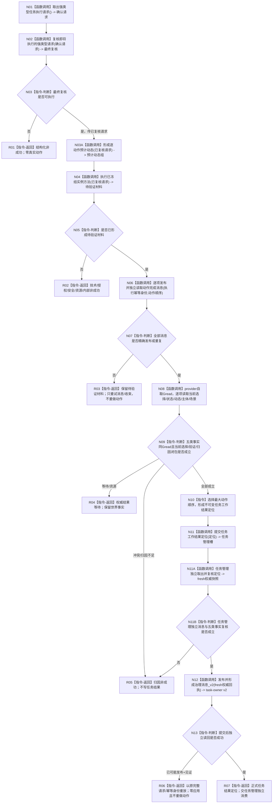

# SELF-GOVERNANCE-CLOSURE-L4-INTEGRATED 动作最终复核与权威结果收束业务流程图 v0.4

更新时间：2026-08-25

## 依据

```text
规范/8100_子规范_自我线程与任务管理线程权责边界_20260720.md 第5、8节
规范/详细设计/20260825_SELF-GOVERNANCE-CLOSURE_L4消费者需求与提供者验收合同_v0.7.md
规范/详细设计/20260825_SELF-GOVERNANCE-CLOSURE-L4-INTEGRATED_自我内部治理连续实现详细设计_v0.6.md
```

## 身份与边界

本图是同身份 v0.3 业务流程图中 Q1—R1 的替代图，只冻结“确认队列取出到正式任务结果独立读回”。任务轮次建立、筹办、结算、轮次收束和自我后继仍引用 v0.3，不在本图重复。

## 流程图



## 节点合同

| 节点 | 类型 | 输入 | 输出 | 事实读写 | 验证 |
| --- | --- | --- | --- | --- | --- |
| N02 | 函数调用 | 确认请求 | fresh完整门控请求对应的新派发冻结或非成功 | 阶段、冻结、控制、调度、method v2、许可、授权、有效时间、安全 fresh 只读 | 任一漂移零动作 |
| N03A | 函数调用 | 已复核请求的三合同 | 非权威预计动态组 | 无正式写入 | 预计动态不得成为事实 |
| N04 | 函数调用 | 已复核请求 | 待验证材料 | 真实动作端口；不写任务结果 | 同键重复不重做动作 |
| N06 | 函数调用 | 每项动作返回 | 不可变完成消息 | 非权威消息账 | 首次/精确重复/独立读取/异义分账 |
| N08 | 函数调用 | 消息候选定位；provider自行取得Gread | 权威结果快照或归因缺口 | L2当前选择/场景/存在/状态/动态正式只读 | 五类事实同 Gread |
| N10 | 本函数内指令 | 全部动作快照 | 任务工作结果定位 | 无 task owner 写入 | worker 只形成定位 |
| N11A | 函数调用 | 工作结果定位 | fresh消息与权威快照 | 任务管理独立只读 | 不信任worker成功或观察截止 |
| N12 | 函数调用 | fresh权威回执 | 正式任务结果或提交见证 | task owner v2 写后独立读回 | 首次/重复带首次证据；已可能发布仅见证；原键重放 |

## 关键边界

```text
动作返回 != 动作完成消息 != 权威世界事实 != 任务实际结果。
任何前级定位都不能跳过后一级独立读回。
归因不足只保留已经发生的世界事实和待验证材料，不推进结算或后继。
```
