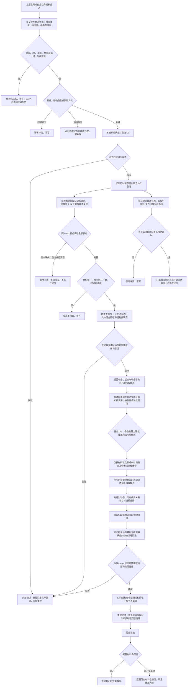

# ARCH-L2-NEUTRAL-STATE-DYNAMIC-LIFECYCLE 业务流程图

版本：v0.1
日期：2026-08-27
状态：实施候选，代码已形成且根工程 Debug / Release 编译通过，待静态门禁与发布

## 冻结说明

- 状态提交和动态提交之间存在正式读回边界；同一候选中的未提交状态不能成为动态成员。
- 动态顺序表示记录颗粒度，不声称相邻成员之间没有现实中间状态。
- 普通引用和当前选择都是状态创建后的独立操作；引用方解释语义，DATA 不裁决权限。
- TTL 使用材料首次形成 UTC 时间，不使用状态描述的事件时间。
- 状态与动态数量上限独立，不合并为共同容量。
- 状态和动态服务内部默认策略为 7 天、状态 1,000,000 项、动态 250,000 项；构造参数带默认值，既有装配调用无需修改，专项可显式传入小策略。
- 状态 TTL 命中但仍被活动动态引用时，先清理相关动态；普通引用不阻止清理，当前选择退出且不自动回退。
- L1 根权威为 `L1物理清理墓碑`；中性/owner读回附各自完整墓碑投影，L2 再形成自己的状态、动态或引用墓碑，L1 不依赖 L2。
- 状态服务的 `执行中性实例状态清理阶段_v1` 是 private；类内隐藏友元桥避免跨 named module 前向声明动态服务，动态服务是唯一生产调用者。
- DATA 服务不启动线程；宿主处理资源同请求续期、漂移换 G0 / 换键一次、内部不一致或序列耗尽程序失败。
- 周期维护使用 `0x4E43'0000'0000'0000` 前缀；抽象完成不得使用。
- 任务阶段顺序形成中性状态、动态和当前选择；两个数据头及下游改存独立中性证据。派发证据只携带引用键、状态 / 当前选择强身份及独立代次，最终当前性复核按键 fresh 读回完整事实，不复制旧事实冒充当前证据。
- 旧 `新增状态_v2` 和原子迁移 v2 不进入本图，均为零写兼容拒绝。
