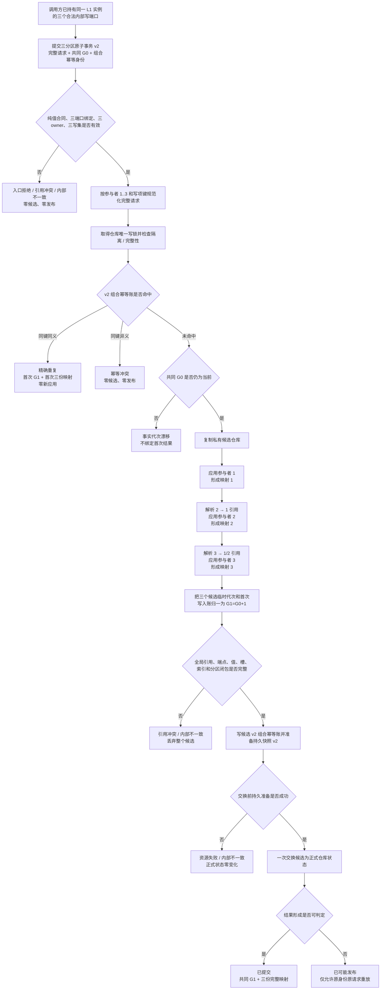

# DATA-L1-THREE-PARTITION-ATOMIC-V2 三分区中性原子事务业务流程图 v0.1

日期：2026-08-28

图类型：DATA-L1 中性结构能力流程

完成边界：只描述三个内部结构分区共同形成一个 L1 事实代次；不表达特征、状态、动态或任何业务成功。



## 接线边界

```text
当前计划：L1 DTO + 三端口入口 + 仓库候选 / 持久 / 恢复

不在当前计划：
L2 特征当前值变化组合器
L2 特征 / 状态 / 动态结构服务接线
被动维护、需求自检和任务执行
```
