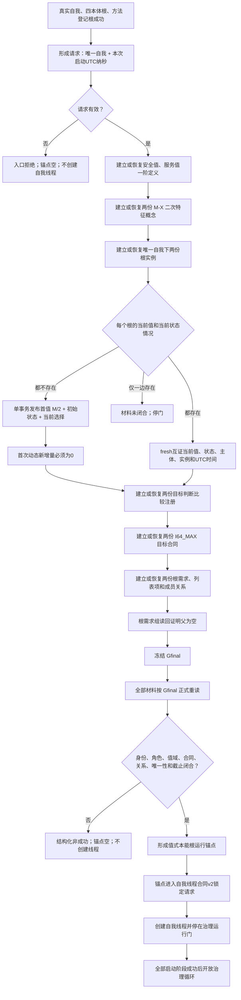
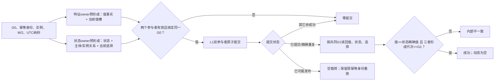
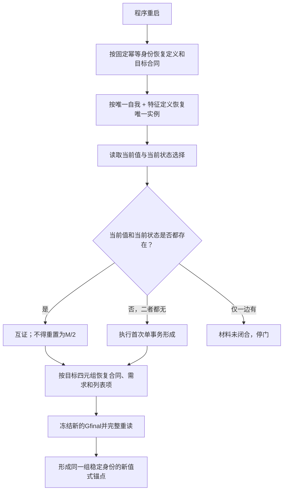

# INSTINCT-BOOTSTRAP-ROOT-ANCHOR 本能根运行锚点业务流程图 v0.1

日期：2026-08-28

状态：设计候选，待创建侧验证与发布

## 1. 启动主流程



## 2. 首值与初始状态单事务



业务权威顺序仍是：

```text
业务确定当前值
→ 建立当前值权威
→ 记录初始状态
```

物理同代提交不改变当前值与状态记录的职责差异。

## 3. 重启恢复



旧锚点截止不跨启动复用。

## 4. 二次特征


## 5. 关键分支

| 分支 | 处理 |
| --- | --- |
| 首次空库 | 固定顺序形成，最终同 Gfinal 读回 |
| 完整重启 | 恢复同一身份，保留运行后当前值 |
| 目标合同已形成但需求未形成 | 按合同幂等首次事实恢复后继续 |
| 列表项已形成但需求未形成 | 精确查询列表项后加入需求 |
| 当前值和当前状态都缺失 | 首值首态单事务形成 |
| 当前值和当前状态都存在 | fresh 互证，不再次形成 |
| 当前值和当前状态仅一边存在 | 材料未闭合，停门 |
| 原子提交已可能发布 | 空载荷，原键重放或重启后正式恢复 |
| 任一截止不等 Gfinal | 当前性漂移，丢弃组合结果 |
| 角色多义或交叉 | 引用冲突/内部不一致，不任选 |
| 初始化失败 | 失败阶段21，不创建自我线程 |

## 6. 排除事项

```text
根差值周期计算
具体需求形成
任务筹办和执行
安全值或服务值结算
结果消费或容量分配
动态迁移
自我治理循环算法
```
