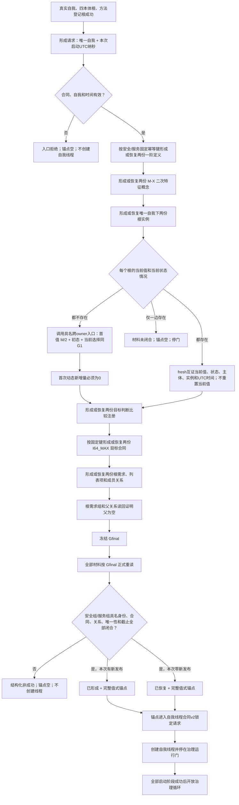
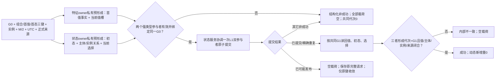
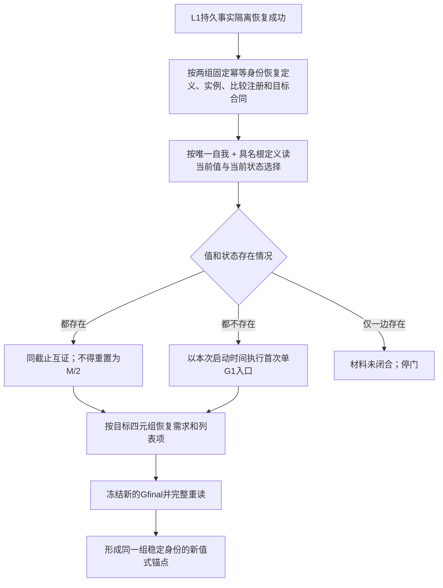
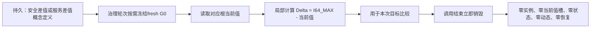

# INSTINCT-BOOTSTRAP-ROOT-ANCHOR 本能根运行锚点业务流程图 v0.2

日期：2026-08-28

状态：设计候选，待创建侧验证与发布

## 1. 启动主流程



具名安全/服务字段是值式角色绑定。它们由两组固定幂等身份和同 `Gfinal` 正式读回共同证明，不建立角色节点、第二 owner 或索引。

## 2. 首值与初始状态跨 owner 单 G1



L1 运输槽固定映射为“状态槽承载初态 owner、动态槽承载首值 owner”；运输字段名不改变业务语义，本入口从不形成动态。

## 3. 重启恢复



已有首态首次账时必须恢复其原 UTC 时间，不以新启动时间重放同一首态身份。旧锚点截止不跨启动复用。

## 4. 二次特征



## 5. 非成功矩阵

| 分支 | 处理 |
| --- | --- |
| 坏合同、零自我、零 UTC | 入口拒绝，锚点空 |
| fixed key 绑定异义材料 | 幂等冲突，锚点空 |
| 两根交叉、重复或绑定错误 | 引用冲突，锚点空 |
| 当前值/状态仅一边存在 | 材料未闭合，锚点空 |
| 合同或必要角色材料已退出 | 角色已退出，锚点空 |
| 原子结果未知 | 已可能发布，空载荷，原键收敛 |
| 任一读回截止不等 Gfinal | 当前性漂移，丢弃组合结果 |
| 端口、映射或载荷矛盾 | 内部不一致，锚点空 |
| 任一初始化非成功 | 失败阶段21，不创建自我线程，不开放治理门 |

新 DATA 合同不产生 `许可拒绝`。验收由生产二进制之外的调用者在实际使用阶段执行；生产 `入口.cpp` 不增加专项模式或运行器。

## 6. 排除事项

```text
旧新增状态_v2恢复或消费
生产专项/自检入口
根差值周期计算
具体需求形成
任务筹办和执行
安全值或服务值结算
结果消费或容量分配
动态迁移
自我治理循环算法
```
