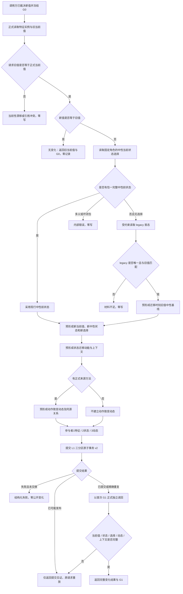

# 真实当前值变化与中性状态动态原子记录业务流程图

日期：2026-08-28
版本：v0.1
状态：目标业务流程



## 接线边界

```text
业务规则只负责裁决新值、主体、共同场景和来源
L2组合服务只负责结构、引用、幂等、原子发布和读回
特征当前值是后继比较权威
状态/动态只保存记录、上下文和变化证据
```

本图不包含安全/服务维护规则、根需求自检和任务执行；这些是阶段三及后继流程。
