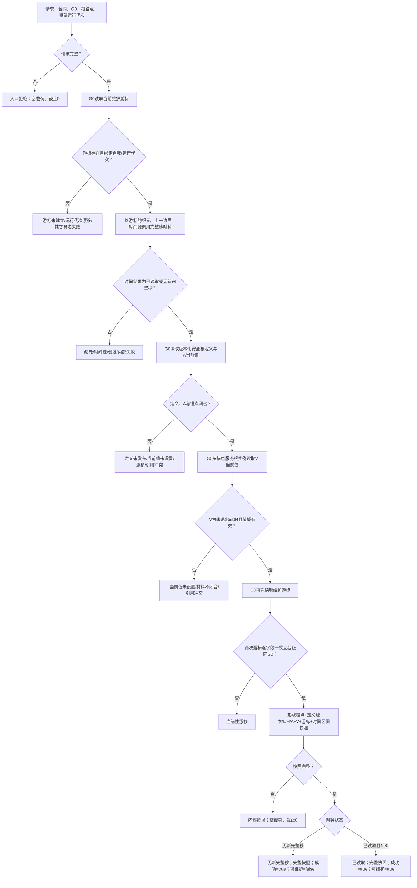

# 读取本能被动维护基础快照函数流程图 v0.1

日期：2026-08-29

设计身份：`INSTINCT-STAGE3-MAINTENANCE-BASE-SNAPSHOT-COMPOSER`

根函数：`本能被动维护基础快照组合器::读取本能被动维护基础快照_v1`

L/H 只来自 `安全根定义与当前值服务` 返回的正式定义版本。当前版本 1 的 30%/80% 只是该版本的发布事实；后继版本可以改变阈值，组合器不重算、不缓存、不固定版本 1。

服务合同、活动、到期事件和安全低位回升门禁不属于本函数。缺少这些后继完整集合时，调用方必须 fail-closed，不能把本基础快照当作完整单秒规则请求。
