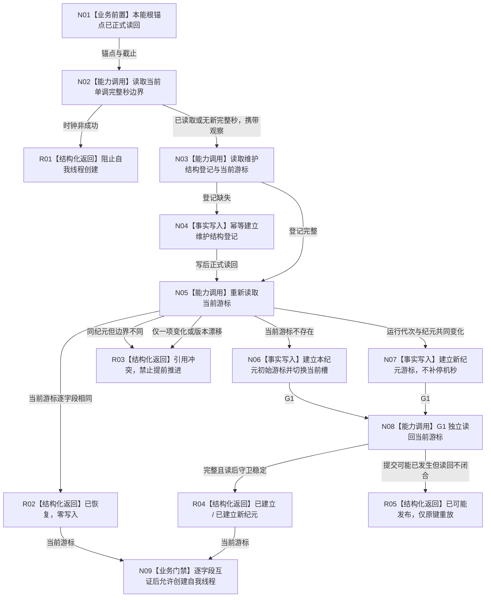

# INSTINCT-STAGE3-MAINTENANCE-CURSOR-FOUNDATION 本能被动维护游标基础业务流程图 v0.1

更新时间：2026-08-29

## 依据

```text
规范/4015_子规范_L1简化事实基座.md v2.2
规范/4040_子规范_不透明结构事务候选确认撤销与最后发布.md v1.8
规范/6170_子规范_服务值时间维护生存安全回归与任务门控.md（HEAD 现行版本）
计划/20260828_INSTINCT-ROUTE_本能路线后续计划制定方案_v0.1.md
规范/详细设计/20260829_INSTINCT-STAGE3-MAINTENANCE-CURSOR-FOUNDATION_本能被动维护游标基础详细设计_v0.1.md
当前代码：本能根运行初始化、完整秒时钟、L1 owner-scoped CRUD 与持久恢复管理面
```

## 身份与边界

本图是阶段三初始维护游标的正式目标业务图。它只冻结“根形成后建立 / 恢复维护起点”的闭环，不表示同一纪元内完整秒推进，也不包含 A/V、状态 / 动态、合同或安全事件维护。

## 流程图



## 节点合同

| 节点 | 输入 | 输出 | 事实读写 | 验证 |
| --- | --- | --- | --- | --- |
| N01 | `本能根运行锚点_v1` | 唯一自我与根截止 | 只读 | 锚点完整且根实例同属唯一自我 |
| N02 | 运行代次、纪元、上一边界 0、时间源版本 | 当前边界观察 | 只读正式单调时间 | `已读取` / `无新完整秒` 分账 |
| N03/N05 | G0、自我 | 登记与当前游标 | L1 owner 当前读 | 读前守卫与唯一当前槽 |
| N04 | 固定登记身份 | 登记锚点、游标节点、属性类型 | 单 owner 幂等写 | 同键异义冲突；写后读回 |
| N06 | 本次运行代次、纪元和边界 | 初始游标 | 单 owner 幂等写 | 不补根形成前的秒 |
| N07 | 新运行代次 + 新纪元 | 新当前游标 | 新值 + 当前槽切换 | 旧值历史保留；不补停机秒 |
| N08 | G1、自我 | 完整当前游标 | 正式独立读回 | 读后守卫；提交未知分账 |
| N09 | 读回游标与时钟观察 | 自我线程创建许可 | 零写 | 只表示启动前置完整，不表示维护已推进 |

## 业务—能力—函数映射

| 业务能力 | 复用 / 新建 | 目标函数 |
| --- | --- | --- |
| 正式完整秒观察 | 复用 | `完整秒时钟服务::读取当前完整秒边界(...)` |
| 唯一维护 owner 装配 | 新建 | 普通应用装配中的本能被动维护游标 owner 建立与服务构造 |
| 建立 / 恢复游标 | 新建 | `本能被动维护游标服务::建立或恢复本能被动维护游标_v1(...)` |
| 当前游标独立读回 | 新建 | `本能被动维护游标服务::读取当前本能被动维护游标_v1(...) const` |
| 启动前生产消费 | 适配 | `启动应用程序(...)` 在本能根初始化后、自我线程创建前调用 |

## 关键边界

```text
本入口不推进同一纪元游标。
本入口不读取或改变 A、V、L/H。
本入口不生成状态或动态。
本入口不把循环次数、Tick、消息数或墙钟当完整秒。
新纪元不补算停机区间。
后继只有在 A/V 及状态/动态候选共同闭合后，才可用 L1 v3 同事务推进游标。
```
