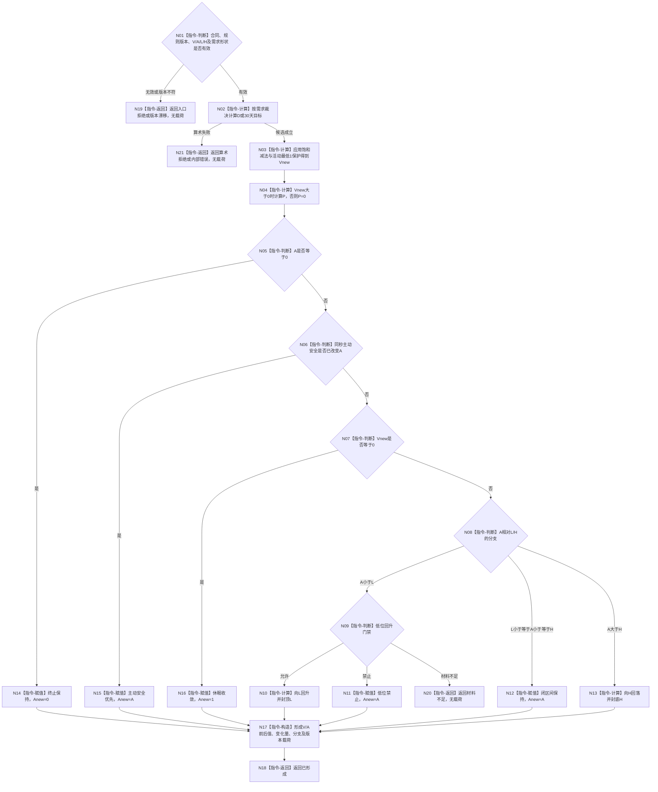

# INSTINCT-STAGE3-PASSIVE-MAINTENANCE-RULE-KERNEL 计算单完整秒被动维护候选函数流程图 v0.1

更新时间：2026-08-29

## 依据

```text
0050 v2.1
6100 v0.5、6120 v0.10、6170 v0.6
INSTINCT-ROUTE v0.1
详细设计：20260829_INSTINCT-STAGE3-PASSIVE-MAINTENANCE-RULE-KERNEL v0.1
```

## 身份与边界

本图是待新增纯值根函数的正式目标函数图。它只计算一个完整秒的 V/A 候选，不读取或写入事实，不读取时间，不证明合同 / 活动 / 安全门禁材料完整，不推进游标。

## 函数合同

```text
根函数：计算本能单完整秒被动维护候选_v1
归属模块：海中鱼巣.领域.算法.本能单完整秒被动维护
物理文件：海中鱼巣/领域/算法.本能单完整秒被动维护.ixx
现有或待新增：待新增
完整签名：本能单完整秒被动维护结果_v1 计算本能单完整秒被动维护候选_v1(const 本能单完整秒被动维护请求_v1& 请求) noexcept
参数：请求为只读借用；非法版本、值域、需求形状、活动或门禁组合拒绝
返回结果：已形成携带完整纯值载荷；入口 / 版本 / 材料 / 算术 / 内部非成功均无载荷
被调函数流程图：无；安全乘除和结果完整性是本函数内局部指令
```

## 流程图



## 节点合同

| 节点 | 类型 | 参数 / 输入绑定 | 结果 / 输出绑定 | 事实读写 | 后继条件 | 验证 |
| --- | --- | --- | --- | --- | --- | --- |
| N01 | 指令-判断 | 完整请求 | 有效性 / 版本性 | 无 | 有效 / 拒绝 | P00 |
| N02 | 指令-计算 | 需求裁决、t、D0、T | D 或目标值 | 无 | 成立 / 算术拒绝 | P01—P03 |
| N03 | 指令-计算 | V、D/目标、活动 | Vnew、实际减少 | 无 | 完成 | P01—P03 |
| N04 | 指令-计算 | Vnew、U | P=0或1..99 | 无 | 完成 | P04 |
| N05—N09 | 指令-判断 | A、Vnew、L/H、主动安全、门禁 | 唯一安全分支 | 无 | 具名分支 | P05—P06 |
| N10/N13 | 指令-计算 | 距离、P | Anew | 无 | 封顶/封底完成 | P06 |
| N11/N12/N14—N16 | 指令-赋值 | 当前分支 | Anew | 无 | 完成 | P05—P06 |
| N17 | 指令-构造 | 全部计算结果 | 完整载荷 | 无 | 完整 / 内部错误 | P07 |
| N18—N21 | 指令-返回 | 载荷或失败状态 | 合同结果 | 无 | 返回 | P00—P08 |

## 关键边界

```text
生产调用方必须先从完整权威材料形成强类型请求；本函数不接受空集合猜测。
不使用float/double、UINT64_MAX、线程Tick、调用次数或墙钟。
无事实读写、无日志、无缓存、无持久身份、无游标推进。
单秒内核通过不证明批量N秒等价、生产聚合或阶段三完成。
```
