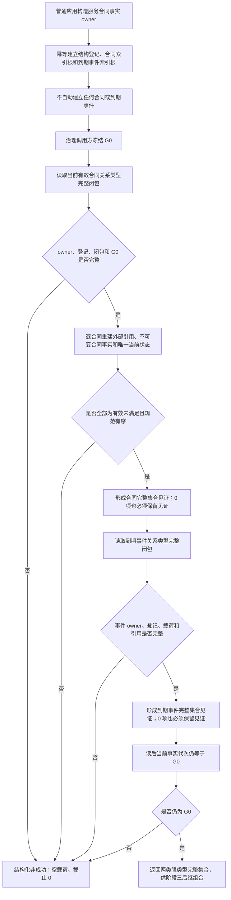
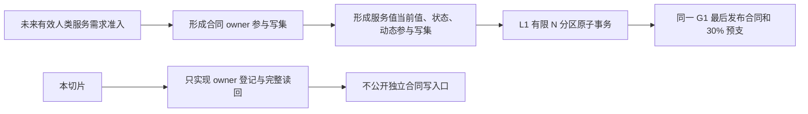

# INSTINCT-STAGE3-SERVICE-CONTRACT-FACT-OWNER 服务合同事实完整集合业务流程图 v0.1

日期：2026-08-29

## 1. 业务目标

把“当前有哪些有效未满足服务合同、有哪些正式到期未满足事件”收口为唯一 owner 在同一事实截止下可证明完整的强类型集合，不再用四次相同的“按自我读取全部当前状态”猜测业务分类。

## 2. 流程

## 3. 发布边界

## 4. 完成边界

该流程图只冻结结构 owner 和完整集合读回。合同准入、预支、终态、有效活动、衰减、回归和生产线程消费仍由后继流程图与计划承接。
