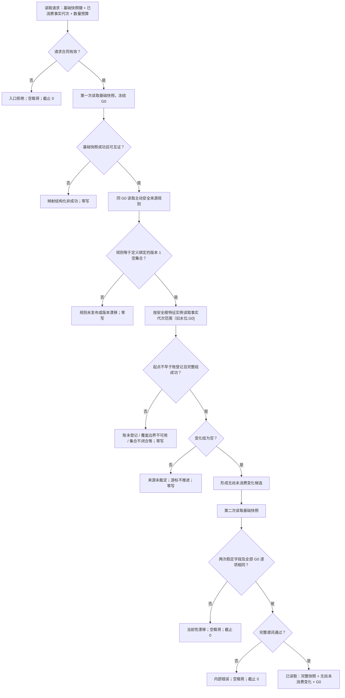

# INSTINCT-STAGE3-ACTIVE-SAFETY-FACT-GENERATION-COVERAGE 主动安全事实代次覆盖裁决函数流程图 v0.1

日期：2026-08-30

## 边界

- 事实代次保证从旧水位到 G0 的发布连续覆盖。
- UTC 仍在每条账事实中保存，但本函数不以 UTC 构造覆盖窗口，也不把账项分配到单调完整秒。
- 当前规则版本 1 下，非空变化组一律 fail-closed。
- 本函数只读，不修改 A、V、状态、动态、来源规则或维护游标。
